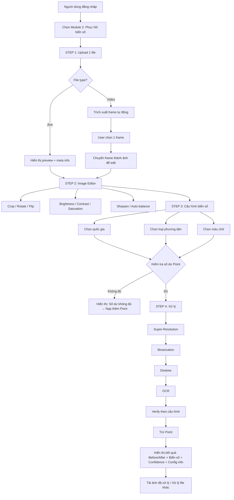
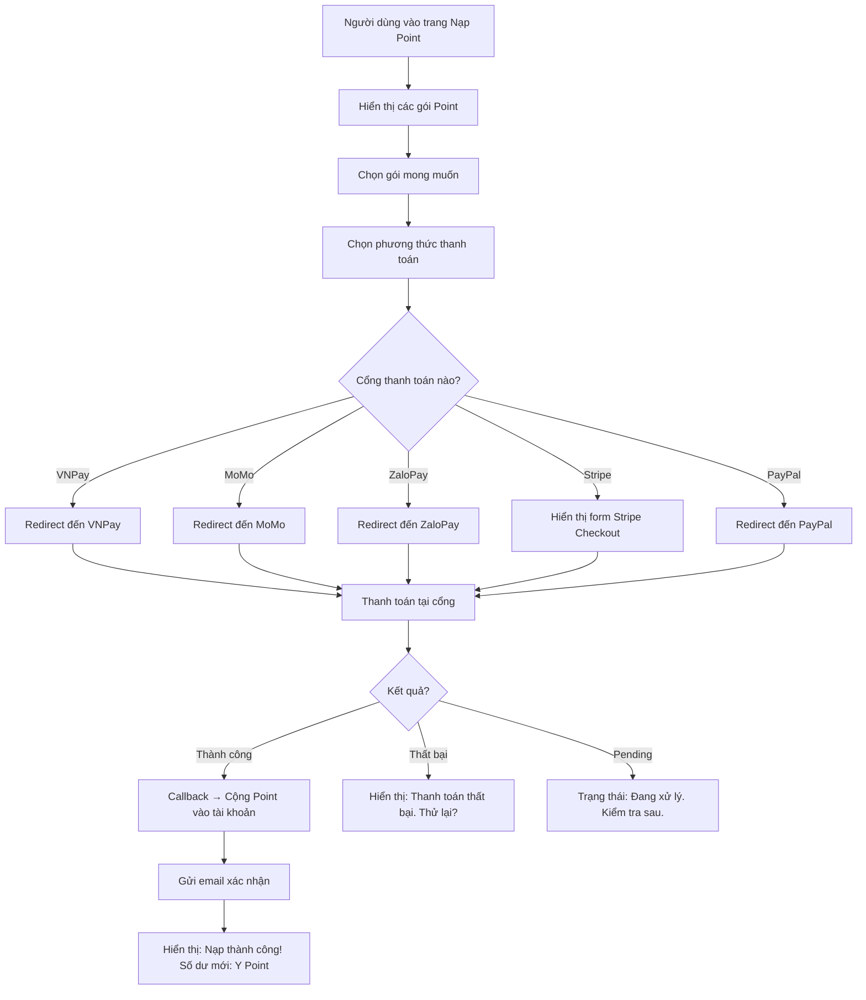
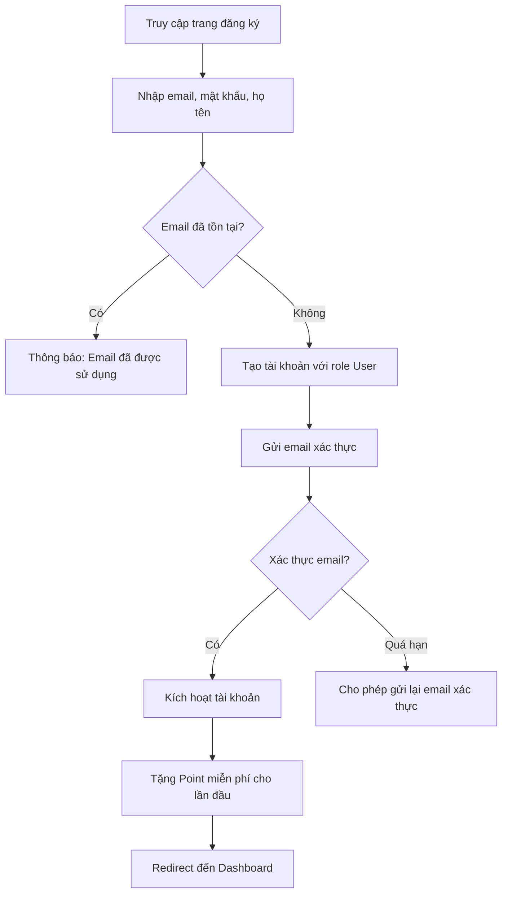
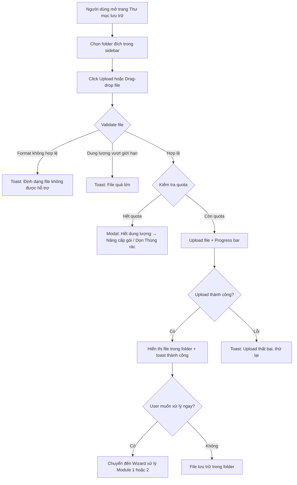
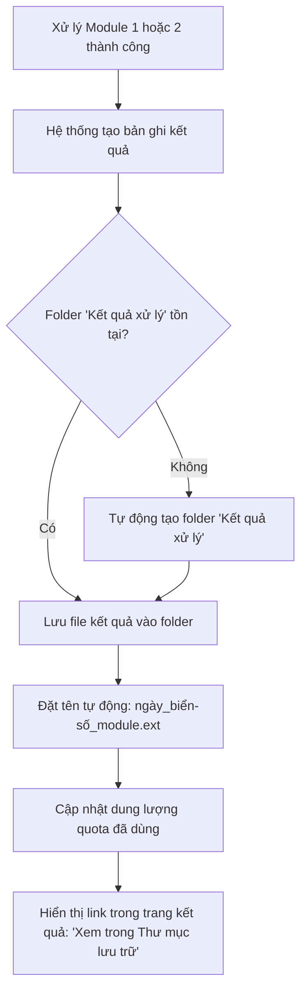
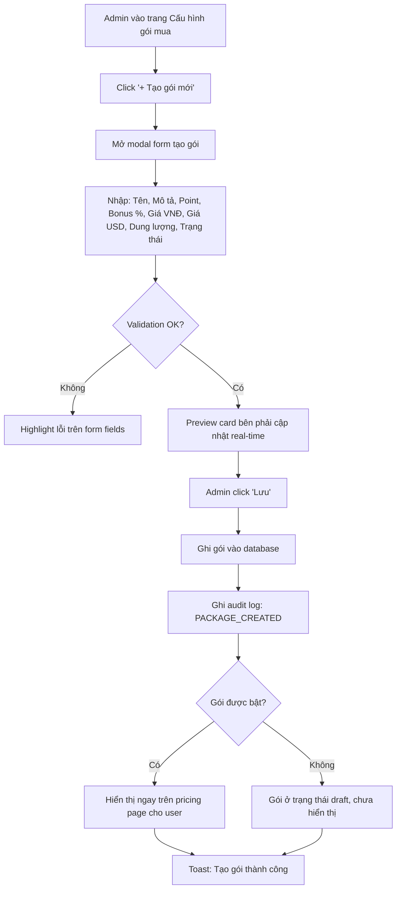
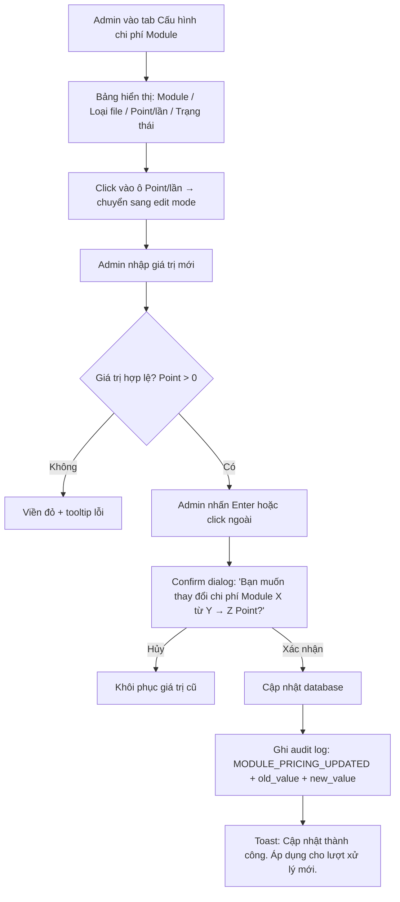

# Tài Liệu Brainstorm — Phần Mềm SaaS Khôi Phục Video & Phục Hồi Biển Số Xe

**Phiên bản:** 1.2  
**Ngày tạo:** 19/05/2026  
**Cập nhật lần cuối:** 19/05/2026  
**Ngôn ngữ:** Tiếng Việt  
**Ưu tiên nghiên cứu:** Module 2 — Phục hồi biển số xe  
**Cập nhật v1.1:** Thêm tính năng Thư mục lưu trữ (Storage Folder) & Cấu hình gói mua (Subscription Package Settings)  
**Cập nhật v1.2:** Đồng bộ trạng thái triển khai từ mockup HTML + design specs  

---

## Mục Lục

1. [Tổng quan dự án](#1-tổng-quan-dự-án)
2. [Nghiên cứu đối thủ cạnh tranh — Module 2: Phục hồi biển số xe](#2-nghiên-cứu-đối-thủ-cạnh-tranh--module-2-phục-hồi-biển-số-xe)
3. [Nghiên cứu đối thủ cạnh tranh — Module 1: Khôi phục video hỏng](#3-nghiên-cứu-đối-thủ-cạnh-tranh--module-1-khôi-phục-video-hỏng)
4. [Nghiên cứu mô hình thanh toán & cổng thanh toán](#4-nghiên-cứu-mô-hình-thanh-toán--cổng-thanh-toán)
5. [Mẫu UI/UX tham khảo](#5-mẫu-uiux-tham-khảo)
6. [Phân rã tính năng & User Stories](#6-phân-rã-tính-năng--user-stories)
7. [Luồng xử lý & Quy tắc nghiệp vụ](#7-luồng-xử-lý--quy-tắc-nghiệp-vụ)
8. [Bảng thuật ngữ chuyên ngành](#8-bảng-thuật-ngữ-chuyên-ngành)
9. [**[MỚI]** Nghiên cứu tính năng Thư mục lưu trữ (Storage Folder)](#9-nghiên-cứu-tính-năng-thư-mục-lưu-trữ)
10. [**[MỚI]** Nghiên cứu tính năng Cấu hình gói mua — Admin (Subscription Package Settings)](#10-nghiên-cứu-tính-năng-cấu-hình-gói-mua)
11. [Cập nhật phân loại ưu tiên MoSCoW (v1.1)](#11-cập-nhật-phân-loại-ưu-tiên-moscow)
12. [**[MỚI v1.2]** Trạng thái triển khai (Implementation Status)](#12-trạng-thái-triển-khai)

---

## 1. Tổng Quan Dự Án

### 1.1. Bối cảnh

Xây dựng một nền tảng SaaS web cung cấp hai dịch vụ xử lý media dựa trên AI:

- **Module 1 — Khôi phục video hỏng:** Sửa chữa file video bị lỗi codec, mất header (moov atom), truncated, hoặc không phát được.
- **Module 2 — Phục hồi biển số xe (ưu tiên):** Tăng cường chất lượng ảnh/video mờ để nhận dạng và phục hồi biển số xe bằng công nghệ Super-Resolution và OCR.

### 1.2. Đối tượng người dùng

| Nhóm người dùng | Nhu cầu chính |
|---|---|
| Cá nhân & freelancer | YouTuber, editor cần sửa video hỏng; người dùng cần đọc biển số từ dashcam |
| Doanh nghiệp vận tải / logistics | Quản lý đội xe, bãi xe thông minh, trạm thu phí |
| Cơ quan an ninh & giám sát | Camera giao thông, hệ thống giám sát đô thị, điều tra CSGT |
| Admin hệ thống | Quản lý người dùng, cấu hình gói dịch vụ, theo dõi doanh thu |

### 1.3. Phạm vi tính năng

- Đăng nhập / đăng ký tài khoản SaaS (multi-tenant)
- Quản lý người dùng theo vai trò (Admin, User)
- Module xử lý video & biển số xe
- Hệ thống Point (credit) — nạp tiền mua point, trừ point theo lượt sử dụng
- Cấu hình gói mua point (Admin)
- Cấu hình chi phí point cho mỗi module (Admin)
- Tích hợp cổng thanh toán Việt Nam & quốc tế
- **[MỚI] Thư mục lưu trữ (Storage Folder)** — Người dùng có thể tạo folder, upload/tải file, quản lý kết quả xử lý theo thư mục
- **[MỚI] Cấu hình gói mua (Subscription Package Settings)** — Admin tạo/sửa/xóa/bật-tắt gói mua Point, cấu hình giá, bonus, giới hạn dung lượng lưu trữ theo gói

---

## 2. Nghiên Cứu Đối Thủ Cạnh Tranh — Module 2: Phục Hồi Biển Số Xe

### 2.1. Các sản phẩm ALPR/ANPR quốc tế nổi bật

| Sản phẩm | Mô tả | Mô hình giá | Điểm mạnh | Điểm yếu |
|---|---|---|---|---|
| **[Plate Recognizer](https://platerecognizer.com/)** | API nhận dạng biển số xe cloud & SDK on-premise. Hỗ trợ 100+ quốc gia. | Subscription theo số lượng Lookup/tháng. Gói Small: 50K lookups/tháng ~$75. Free trial không cần thẻ. | Phủ rộng quốc gia, SDK đa nền tảng, tài liệu API chi tiết, có nhận dạng hãng xe + model | Chưa có tính năng super-resolution phục hồi biển số mờ |
| **[Rekor / OpenALPR](https://www.openalpr.com/)** | Bộ giải pháp vehicle intelligence dùng AI/ML. Sản phẩm chính: Rekor Scout (nâng cấp camera IP), Rekor CarCheck (phân tích ảnh xe). | Liên hệ báo giá (enterprise) | Tích hợp sâu camera IP, dùng cho thành phố thông minh, có mobile app | Giá cao, không công khai pricing, hướng enterprise |
| **[Sighthound ALPR+](https://www.sighthound.com/products/alpr)** | Nhận dạng biển số + phân tích phương tiện. Deploy trên edge hoặc cloud. | Enterprise license | Linh hoạt edge/cloud, vehicle analytics nâng cao | Không có free tier, hướng B2B lớn |
| **[Vaxtor Cloud (Carmen®)](https://www.vaxtor.com/)** | ANPR cloud-based, xử lý trên camera hoặc cloud. Hỗ trợ toàn cầu. | License theo camera hoặc API call | Xử lý on-camera giảm latency, phủ rộng toàn cầu | Chủ yếu cho hạ tầng camera, không phải web SaaS |
| **[Placa.ai](https://www.placa.ai/)** | ALPR cho bất động sản nhỏ, tích hợp camera đơn giản. | Gói cơ bản từ ~$29/tháng | Giá rẻ, dễ setup cho quy mô nhỏ | Ít tính năng nâng cao, không có super-resolution |

### 2.2. Sản phẩm ALPR tại Việt Nam

| Sản phẩm | Mô tả | Điểm mạnh | Điểm yếu |
|---|---|---|---|
| **[VietANPR (VisCom Solution)](https://viscomsolution.com/viet-anpr-phan-mem-nhan-dien-bien-so-xe-may-xe-hoi/)** | Phần mềm nhận diện biển số xe máy & xe hơi Việt Nam, đọc từ ảnh/camera. | Tối ưu cho biển số VN (cả xe máy), tích hợp bãi xe | Chủ yếu on-premise, không có cloud API |
| **[BBANPR (Biển Bạc)](https://giaiphapbienbac.com/)** | Engine nhận dạng biển số AI, huấn luyện trên hàng triệu ảnh, độ chính xác >99%. | Độ chính xác cao cho biển VN, có engine AI riêng | Hướng tích hợp phần cứng bãi xe, không phải SaaS |
| **[ADG Technology](https://adg.vn/)** | Giải pháp tổng thể nhận diện biển số xe, từ phần cứng đến phần mềm, hỗ trợ on-premise & cloud. | Giải pháp end-to-end, có cloud option | Chủ yếu dự án tích hợp, không phải self-service SaaS |
| **[VinParking](https://vinparking.com/)** | Phần mềm nhận dạng biển số cho hệ thống bãi xe thông minh. | Tối ưu cho parking, nhận dạng nhanh | Chỉ phục vụ bãi xe, không có tính năng phục hồi ảnh mờ |

### 2.3. Công nghệ Super-Resolution phục hồi biển số

Đây là **điểm khác biệt cốt lõi** của Module 2 so với các đối thủ ALPR truyền thống — hầu hết đối thủ chỉ nhận dạng biển số rõ nét, **không có tính năng phục hồi biển số từ ảnh/video mờ**.

| Công nghệ | Mô tả | Kết quả |
|---|---|---|
| **D_GAN_ESR** (Double GAN for Enhancement & Super Resolution) | Dùng 2 mạng GAN nối tiếp để khử nhiễu + tăng độ phân giải | Tăng độ chính xác OCR từ 30% → 78% (ảnh mờ), từ 59% → 74.5% (ảnh chất lượng thấp) |
| **SISR + Attention/Transformer** | Single-Image Super-Resolution kết hợp attention module và PixelShuffle | Cải thiện nhận dạng cấu trúc và texture biển số |
| **Multi-frame Fusion** | Kết hợp nhiều frame video để tái tạo ảnh rõ nét hơn | Cải thiện 30-100% khả năng đọc biển số, phù hợp cho video camera giám sát |

**Lưu ý thực tế:** Phục hồi hoàn toàn từ ảnh cực mờ, độ phân giải rất thấp, hoặc bị che khuất nặng là **không khả thi**. Cần đặt kỳ vọng đúng cho người dùng.

### 2.4. Bài viết LinkedIn & nghiên cứu tham khảo

- [IEEE Xplore — Enhancement for License Plate Recognition using Image Super Resolution](https://ieeexplore.ieee.org/document/9514106/)
- [NCBI — A New Image Enhancement and Super Resolution technique for license plate recognition](https://www.ncbi.nlm.nih.gov/pmc/articles/PMC8605205/)
- [ArXiv — Super-Resolution of License Plate Images Using Attention Modules](https://arxiv.org/pdf/2305.17313)
- [Superresolution.co — Eliminating Blurriness and License Plate Recognition](https://superresolution.co/eliminating-blurriness-and-license-plate-recognition/)
- [Plate Recognizer — Top 10 ALPR Software Solutions 2026](https://platerecognizer.com/top-10-alpr-software-solutions/)
- [Plate Recognizer — ALPR Software Providers Comparison](https://platerecognizer.com/automatic-license-plate-recognition-software-providers-a-detailed-comparison/)

### 2.5. Cơ hội thị trường & lợi thế cạnh tranh

**Khoảng trống thị trường (Market Gap):**

- Hầu hết sản phẩm ALPR **chỉ nhận dạng biển số rõ nét** → không phục vụ nhu cầu phục hồi từ ảnh/video mờ.
- Tại Việt Nam, các giải pháp đều **hướng tích hợp phần cứng (bãi xe, camera)** → chưa có SaaS self-service cho cá nhân.
- **Chưa có sản phẩm nào kết hợp** super-resolution + OCR biển số + mô hình SaaS pay-per-use.

**Lợi thế cạnh tranh đề xuất:**

1. **Super-Resolution + OCR** = giá trị độc đáo mà đối thủ ALPR chưa có
2. **Web SaaS self-service** = dễ tiếp cận hơn các giải pháp tích hợp phần cứng
3. **Hỗ trợ biển số Việt Nam** (cả xe máy, xe ô tô, biển 1 dòng, 2 dòng) = ưu thế nội địa
4. **Mô hình pay-per-use (Point)** = chi phí thấp cho người dùng nhỏ lẻ, mở rộng cho doanh nghiệp

---

## 3. Nghiên Cứu Đối Thủ Cạnh Tranh — Module 1: Khôi Phục Video Hỏng

### 3.1. Sản phẩm khôi phục video online (SaaS / Web)

| Sản phẩm | Mô tả | Mô hình giá | Điểm mạnh | Điểm yếu |
|---|---|---|---|---|
| **[EaseUS Online Video Repair](https://repair.easeus.com/)** | Sửa video hỏng bằng AI, hỗ trợ MOV, MP4, M4V, MKV, AVI, FLV... | Freemium (giới hạn dung lượng miễn phí) | AI tự động sửa, hỗ trợ nhiều định dạng, giao diện đơn giản | Giới hạn dung lượng file miễn phí |
| **[Fix.Video](https://fix.video/)** | Upload video hỏng → tải video đã sửa. Chuyên biệt cho dashcam. | Miễn phí giới hạn / trả phí theo file | Tối ưu cho dashcam (Novatek, Blackvue, Nextbase...) | Chỉ tập trung dashcam, ít format |
| **[Clever Online Video Repair](https://repair.cleverfiles.com/)** | Không re-encode, khôi phục frame gốc bị mất, giữ nguyên chất lượng. | Freemium | Giữ nguyên chất lượng gốc, không re-encode | Cần file mẫu (reference video) cùng thiết bị |
| **[RepairVideoFile](https://repairvideofile.com/)** | Dùng AI/ML sửa moov atom, khôi phục header video MP4/MOV/AVI. | Miễn phí | Hoàn toàn miễn phí, dùng deep learning | Giới hạn loại lỗi có thể sửa |
| **[Stellar Video Repair](https://repair.stellarinfo.com/)** | Sửa video online, hỗ trợ nhiều lỗi: blank, freezing, out of sync... | Freemium + subscription | Thương hiệu uy tín, hỗ trợ nhiều loại lỗi | Tính năng nâng cao cần trả phí |

### 3.2. Phần mềm desktop nổi bật

| Sản phẩm | Điểm mạnh |
|---|---|
| **VikPea (4DDiG)** | AI repair + enhancement cùng lúc, tỷ lệ thành công 92% (2025) |
| **HitPaw Video Repair** | Giao diện thân thiện, AI upscale + repair |
| **AnyRecover Video Repair** | Hỗ trợ nhiều format, batch repair |

### 3.3. Cơ hội & lợi thế

**Khoảng trống:**

- Hầu hết dịch vụ online **miễn phí/freemium nhưng giới hạn** dung lượng hoặc số file → có cơ hội cho mô hình pay-per-use linh hoạt hơn.
- Chưa có sản phẩm nào **kết hợp khôi phục video + phục hồi biển số** trong cùng một nền tảng.
- Các sản phẩm Việt Nam gần như **không có** trong lĩnh vực này.

**Lợi thế đề xuất:**

1. Kết hợp 2 module trên 1 nền tảng → cross-sell, tăng giá trị
2. Pay-per-use bằng Point → linh hoạt hơn subscription cứng
3. Hỗ trợ tiếng Việt + thanh toán nội địa = ưu thế cho thị trường VN

---

## 4. Nghiên Cứu Mô Hình Thanh Toán & Cổng Thanh Toán

### 4.1. Mô hình Credit/Point-Based Billing

**Cách hoạt động:** Người dùng mua trước một lượng Point (credit), mỗi lần sử dụng module sẽ trừ Point tương ứng. Mỗi Point đại diện cho một đơn vị giá trị xác định (ví dụ: 1 lần xử lý video = 10 Point, 1 lần nhận dạng biển số = 5 Point).

**Các thành phần kiến trúc chính:**

| Thành phần | Vai trò |
|---|---|
| **Credit Ledger** (Sổ cái Point) | Lưu trữ số dư, lịch sử giao dịch của mỗi tài khoản |
| **Transaction Processor** (Bộ xử lý giao dịch) | Trừ/cộng Point, xử lý hoàn trả, đảm bảo tính nhất quán |
| **Notification Service** (Dịch vụ thông báo) | Cảnh báo Point sắp hết, xác nhận giao dịch |
| **Metering Service** (Dịch vụ đo lường) | Đếm số lần sử dụng, tổng hợp metrics |
| **Dashboard** (Bảng điều khiển) | Hiển thị số dư real-time, lịch sử, thống kê |

**Best practices quan trọng:**

- **Minh bạch:** Hiển thị số dư Point real-time, ước tính chi phí trước khi xử lý.
- **Cảnh báo:** Gửi thông báo khi Point sắp hết (low-balance alert).
- **Hard cap:** Cho phép Admin đặt giới hạn sử dụng tối đa để tránh chi tiêu ngoài kiểm soát.
- **Idempotency:** Đảm bảo không trừ Point trùng lặp khi retry.

**Tham khảo thiết kế:**

- [ColorWhistle — SaaS Credits System Guide 2026](https://colorwhistle.com/saas-credits-system-guide/)
- [Lago — Credit-Based Pricing Models](https://getlago.com/blog/credit-based-pricing)
- [Schematic — Credit-Based System for SaaS Pricing](https://schematichq.com/blog/is-a-credit-based-system-the-right-fit-for-your-saas-pricing)

### 4.2. Cổng thanh toán Việt Nam

| Cổng thanh toán | Số người dùng | Phương thức | Phí giao dịch ước tính | Ghi chú |
|---|---|---|---|---|
| **[VNPay](https://vnpay.vn/)** | Phổ biến nhất VN | QR Pay, thẻ nội địa, thẻ quốc tế, ví điện tử | ~1.0-1.5% | SDK Laravel có sẵn, tích hợp phổ biến nhất |
| **[MoMo](https://momo.vn/)** | 31+ triệu | Ví MoMo, QR, chuyển khoản | ~1.0-1.5% | Nhiều đối tác, API tốt, phổ biến người dùng cá nhân |
| **[ZaloPay](https://zalopay.vn/)** | Đang tăng trưởng | ZaloPay QR, ví, liên kết ngân hàng | ~1.0-1.5% | Tích hợp hệ sinh thái Zalo (150M+ user), 12.000+ chuỗi cửa hàng |

**Xu hướng 2026:**

- VietQR đang bùng nổ — cho phép thanh toán liên ngân hàng qua mã QR thống nhất.
- Ngân hàng Nhà nước VN hướng đến **interoperability toàn diện** giữa các nền tảng thanh toán.
- Có thể dùng aggregator như **TransFi** để tích hợp tất cả qua 1 API.

### 4.3. Cổng thanh toán quốc tế

| Cổng thanh toán | Phí giao dịch | Phí quốc tế | Phủ sóng | Tính năng SaaS |
|---|---|---|---|---|
| **[Stripe](https://stripe.com/)** | 2.9% + $0.30 | +1.5% (thêm 1% nếu chuyển đổi tiền tệ) | 46 quốc gia merchant, 135+ tiền tệ | Usage-based billing, metered billing, subscription management, customer portal |
| **[PayPal](https://www.paypal.com/)** | 3.49% + $0.49 | +1.5% (tỷ giá chuyển đổi 3-4% trên base) | 200+ thị trường, 25 tiền tệ | Subscription cơ bản, không có metered billing |

**Khuyến nghị:** Dùng **Stripe** cho thanh toán quốc tế (phí thấp hơn, hỗ trợ usage-based billing tốt hơn) + **VNPay** hoặc **MoMo** cho thanh toán nội địa VN.

### 4.4. Cấu hình gói mua Point đề xuất

| Gói | Số Point | Giá VNĐ | Giá USD | Bonus | Đối tượng |
|---|---|---|---|---|---|
| Starter | 100 | 99.000đ | $3.99 | 0% | Cá nhân dùng thử |
| Basic | 500 | 449.000đ | $17.99 | 10% thêm | Cá nhân thường xuyên |
| Pro | 2.000 | 1.599.000đ | $64.99 | 20% thêm | Doanh nghiệp nhỏ |
| Enterprise | 10.000 | 6.999.000đ | $279.99 | 30% thêm | Doanh nghiệp lớn |
| Custom | Tùy chỉnh | Thỏa thuận | Thỏa thuận | Thỏa thuận | Đối tác / đại lý |

**Lưu ý:** Bảng giá này chỉ mang tính tham khảo. Admin có thể cấu hình tùy ý qua trang quản trị.

---

## 5. Mẫu UI/UX Tham Khảo

### 5.1. Trang Upload & Xử Lý

**Pattern chính:** Step-by-Step Wizard (Single File Processing + Image Editor + Config)

— **Single file upload:** Chỉ cho phép upload 1 file ảnh hoặc video mỗi lần. Drop zone nhận click hoặc kéo thả.
— **File info display:** Sau khi chọn file, hiển thị thông tin file + preview bên phải.
— **Video frame extraction (nếu là video):**
  - Tự động tạo grid các frame mô phỏng từ video (5-8 frame random).
  - Mỗi frame hiển thị thumbnail + timestamp.
  - User chọn 1 frame chứa biển số rõ nhất → chuyển sang bước edit.
  - Nút "Tạo lại frame" để refresh.
— **4-Step Wizard:**
  - **Step 1 — Upload:** Chọn file, xem preview, xác nhận thông tin.
  - **Step 2 — Edit Image:** Canvas editor với tools (crop, rotate, flip, zoom) + sliders (brightness, contrast, saturation). Filter pixel-level simulation (sharpen kernel, auto contrast stretch).
  - **Step 3 — Configure:** Chọn quốc gia (VN/US/JP/KR), loại xe (ô tô/xe máy/xe tải), màu chữ (trắng/đen/vàng/xanh). Mỗi config option dạng card click-to-select. Hiển thị tổng chi phí.
  - **Step 4 — Process & Result:** Animation processing steps (SR → Binarization → Deskew → OCR → Verify). Hiển thị kết quả so sánh Before/After + biển số + confidence + thông tin xử lý + nút download/reset.
— **Preview panel phải:** Panel preview riêng bên phải luôn hiển thị file đã chọn + meta info (tên, kích thước, loại, kích thước ảnh).
— **Result panel trong step 4:** So sánh trước/sau, thông tin xử lý chi tiết (file, quốc gia, phương tiện, màu chữ).
— **Nút actions:** "Tiếp theo" giữa các bước, "Reset" editor, "Xử lý file khác" sau khi hoàn thành.

**Tham khảo:**

- [Eleken — File Upload UI Tips (20+ examples)](https://www.eleken.co/blog-posts/file-upload-ui)
- [LogRocket — Drag and Drop UI Best Practices](https://blog.logrocket.com/ux-design/drag-and-drop-ui-examples/)

### 5.2. Dashboard Người Dùng

**Pattern chính:** Role-Based Dashboard + Progressive Disclosure

- **Thông tin chính (top):** Số dư Point, số lượt xử lý còn lại, thông báo.
- **Hành động nhanh (giữa):** Nút upload video / upload ảnh biển số.
- **Lịch sử xử lý (dưới):** Bảng danh sách các lần xử lý gần đây với trạng thái (đang xử lý, thành công, thất bại).
- **Traffic Light Status:** Dùng hệ màu đỏ/vàng/xanh cho trạng thái xử lý.

**Tham khảo:**

- [Full Clarity — SaaS Dashboard Design Guide](https://fullclarity.co.uk/insights/saas-dashboard-design-guide-ux-ui/)
- [F1Studioz — Smart SaaS Dashboard Design Guide 2026](https://f1studioz.com/blog/smart-saas-dashboard-design/)

### 5.3. Trang Admin

**Layout:**

- Sidebar navigation: Quản lý người dùng / Cấu hình gói Point / Cấu hình module / Thống kê doanh thu / Lịch sử giao dịch.
- Data table với filter, search, export.
- Chart thống kê: doanh thu theo ngày/tháng, số lượt sử dụng theo module, top users.

### 5.4. Trang Thanh Toán / Nạp Point

**Pattern chính:** Card-Based Pricing + Multi-Gateway Checkout

- Hiển thị các gói Point dạng card ngang hàng, highlight gói phổ biến nhất.
- Chọn phương thức thanh toán: tabs hoặc radio buttons cho VNPay / MoMo / ZaloPay / Stripe / PayPal.
- Xác nhận đơn hàng trước khi thanh toán (order summary).
- Redirect đến cổng thanh toán → callback xác nhận → cập nhật Point.

### 5.5. Anti-patterns cần tránh

| Anti-pattern | Hậu quả |
|---|---|
| Không hiển thị số Point sẽ bị trừ trước khi xử lý | Mất niềm tin, khiếu nại |
| Upload form không có validation file format/size | Lãng phí Point, UX kém |
| Không có trạng thái xử lý real-time | User không biết đang xử lý hay bị lỗi |
| Pricing page quá nhiều tùy chọn | Paradox of choice, giảm conversion |
| Thanh toán không có xác nhận (1-click purchase) | Giao dịch nhầm, dispute |

---

## 6. Phân Rã Tính Năng & User Stories

### 6.1. Cấu trúc Epic → Feature → User Story

```
Epic 1: Xác thực & Quản lý tài khoản
├── Feature 1.1: Đăng ký & Đăng nhập
│   ├── US-001: Đăng ký tài khoản bằng email
│   ├── US-002: Đăng nhập bằng email/mật khẩu
│   ├── US-003: Đăng nhập bằng Google/Facebook (OAuth)
│   ├── US-004: Quên mật khẩu / đặt lại mật khẩu
│   └── US-005: Xác thực email sau đăng ký
├── Feature 1.2: Quản lý hồ sơ người dùng
│   ├── US-006: Xem và cập nhật thông tin cá nhân
│   └── US-007: Đổi mật khẩu
└── Feature 1.3: Quản lý người dùng (Admin)
    ├── US-008: Xem danh sách tất cả người dùng ✅
    │   ├── Bảng hiển thị avatar, tên, email, vai trò, Point, giao dịch, trạng thái
    │   └── Hàng thao tác: Xem chi tiết, Chỉnh sửa, Điều chỉnh Point, Khóa/Mở khóa
    ├── US-009: Tìm kiếm, lọc người dùng ✅
    │   ├── Ô tìm kiếm theo tên/email (real-time filter)
    │   └── Bộ lọc vai trò (Admin/User) & trạng thái (Hoạt động/Đã khóa/Chưa xác thực)
    ├── US-010: Khóa / mở khóa tài khoản ✅
    │   ├── Nút toggle 🔒/🔓 trên mỗi dòng (ẩn nếu là chính admin)
    │   ├── Xác nhận trước khi thực hiện (confirm dialog)
    │   └── Ghi log sự kiện USER_LOCK / USER_UNLOCK
    ├── US-011: Xem chi tiết lịch sử sử dụng của người dùng ✅
    │   ├── Modal chia 2 cột: sidebar thông tin + main lịch sử giao dịch
    │   ├── Sidebar: avatar, tên, email, vai trò, trạng thái, Point, tổng nạp/dùng, ngày tạo
    │   ├── Main: 30 giao dịch gần nhất với icon, mô tả, số Point, thời gian
    │   └── Nút tắt: Điều chỉnh Point, Chỉnh sửa (chuyển đến modal tương ứng)
    └── US-012: Cộng/trừ Point thủ công cho người dùng ✅
        ├── Modal với 3 chế độ: Cộng Point (+), Trừ Point (-), Đặt giá trị tuyệt đối (=)
        ├── Validate: không trừ quá số dư, Point > 0
        ├── Nhập lý do điều chỉnh (ghi log)
        └── Ghi giao dịch dạng topup/use kèm gateway='admin'

Epic 2: Module Phục Hồi Biển Số Xe (Ưu tiên)
├── Feature 2.1: Upload ảnh/video biển số (single-file)
│   ├── US-013: Upload 1 ảnh chứa biển số xe ✅
│   │   ├── Native file picker (accept=image/*,video/*) + drag-and-drop
│   │   ├── Chỉ cho phép 1 file/lần, hiển thị thông tin file + preview bên phải
│   │   ├── Preview real-time với thumbnail (ảnh) / icon (video)
│   │   └── Hiển thị tên file, dung lượng, tag loại file, chi phí Point
│   ├── US-014: Upload video chứa biển số xe ✅
│   │   ├── Chung 1 drop zone với ảnh
│   │   └── Tự động hiển thị frame extraction grid sau upload
│   ├── US-015: Xem preview ảnh/video sau upload ✅
│   │   └── Preview panel riêng bên phải với meta info (kích thước, loại, dims)
│   └── US-016: Validation file format và dung lượng ✅
│       ├── Chỉ chấp nhận image/* và video/* MIME types
│       ├── Giới hạn: ảnh ≤ 20MB, video ≤ 500MB
│       └── File không hợp lệ → toast error, yêu cầu chọn lại
├── Feature 2.2: Step-by-Step Wizard (4 bước)
│   ├── US-017: Chỉnh sửa ảnh trước xử lý ✅
│   │   ├── Canvas editor với toolbar: crop, xoay trái/phải, lật ngang/dọc, zoom in/out
│   │   ├── Sliders: brightness (-100→100), contrast (-100→100), saturation (-100→100)
│   │   ├── Sharpen tool (kernel convolution), Auto-balance (contrast stretch)
│   │   ├── Reset về ảnh gốc
│   │   └── Filter simulation trên canvas pixel data
│   ├── US-018: Trích xuất frame từ video ✅
│   │   ├── Upload video → tự động tạo 5-8 frame thumbnail ngẫu nhiên
│   │   ├── Mỗi frame hiển thị thumbnail + timestamp
│   │   ├── Click chọn 1 frame để xử lý
│   │   └── Nút "Tạo lại frame" để refresh danh sách
│   ├── US-019: Cấu hình biển số trước xử lý ✅
│   │   ├── Chọn quốc gia: Việt Nam (🇻🇳), Hoa Kỳ (🇺🇸), Nhật Bản (🇯🇵), Hàn Quốc (🇰🇷)
│   │   ├── Chọn loại phương tiện: Ô tô, Xe máy, Xe tải
│   │   ├── Chọn màu chữ trên biển: Trắng, Đen, Vàng, Xanh
│   │   └── Hiển thị tổng chi phí xử lý
│   ├── US-020: Animation processing steps ✅
│   │   ├── Step 1: Super-Resolution — Tăng cường chất lượng ảnh
│   │   ├── Step 2: Binarization — Chuyển đổi văn bản tương phản
│   │   ├── Step 3: Deskew — Căn chỉnh góc nghiêng biển số
│   │   ├── Step 4: OCR — Nhận dạng ký tự biển số
│   │   └── Step 5: Verify — Xác minh kết quả theo cấu hình
│   └── US-021: Xem kết quả xử lý ✅
│       ├── So sánh Before/After + biển số + confidence score
│       ├── Thông tin xử lý chi tiết: file, quốc gia, phương tiện, màu chữ
│       ├── Nút tải ảnh đã xử lý + xử lý file khác
│       └── Ghi transaction + toast thông báo
└── Feature 2.3: Hỗ trợ biển số quốc tế
    ├── US-022: Hỗ trợ biển số Việt Nam ✅
    ├── US-023: Hỗ trợ biển số Hoa Kỳ, Nhật Bản, Hàn Quốc ✅
    └── US-024: Cấu hình quốc gia giúp AI OCR chính xác hơn

Epic 3: Module Khôi Phục Video Hỏng
├── Feature 3.1: Upload video hỏng
│   ├── US-029: Upload file video bị hỏng
│   ├── US-030: Hỗ trợ nhiều định dạng (MP4, MOV, AVI, MKV, FLV...)
│   └── US-031: Hiển thị thông tin lỗi được phát hiện
├── Feature 3.2: Xử lý khôi phục
│   ├── US-032: Tự động phân tích và sửa lỗi video
│   ├── US-033: Khôi phục header/moov atom bị mất
│   ├── US-034: Sửa lỗi codec, out-of-sync
│   ├── US-035: Hiển thị tiến trình xử lý real-time
│   └── US-036: Thông báo kết quả qua email
├── Feature 3.3: Quản lý kết quả
│   ├── US-037: Preview video đã khôi phục trước khi tải
│   ├── US-038: Tải video đã khôi phục về máy
│   └── US-039: Xem lịch sử khôi phục video
└── Feature 3.4: Khôi phục nâng cao
    ├── US-040: Upload video mẫu (reference) cùng thiết bị để tăng tỷ lệ thành công
    └── US-041: Chọn mức khôi phục (nhanh / sâu)

Epic 4: Hệ Thống Point & Thanh Toán
├── Feature 4.1: Nạp Point
│   ├── US-042: Xem các gói Point có sẵn
│   ├── US-043: Chọn gói và thanh toán qua VNPay
│   ├── US-044: Thanh toán qua MoMo
│   ├── US-045: Thanh toán qua ZaloPay
│   ├── US-046: Thanh toán qua Stripe (thẻ quốc tế)
│   ├── US-047: Thanh toán qua PayPal
│   └── US-048: Nhận Point ngay sau thanh toán thành công
├── Feature 4.2: Trừ Point khi sử dụng
│   ├── US-049: Hiển thị số Point sẽ bị trừ trước khi xử lý
│   ├── US-050: Tự động trừ Point sau khi xử lý thành công
│   ├── US-051: Không trừ Point nếu xử lý thất bại
│   └── US-052: Cảnh báo khi Point sắp hết
├── Feature 4.3: Lịch sử & Hóa đơn
│   ├── US-053: Xem lịch sử nạp Point
│   ├── US-054: Xem lịch sử trừ Point
│   └── US-055: Xuất hóa đơn / biên lai thanh toán
└── Feature 4.4: Cấu hình Point (Admin)
    ├── US-056: Cấu hình số Point cần cho mỗi lần sử dụng Module 1
    ├── US-057: Cấu hình số Point cần cho mỗi lần sử dụng Module 2
    ├── US-058: Tạo/sửa/xóa gói mua Point
    ├── US-059: Cấu hình bonus Point theo gói
    └── US-060: Xem thống kê doanh thu và lượt sử dụng

Epic 5: Thư mục lưu trữ (Storage Folder) — [CHI TIẾT XEM SECTION 9.4]
├── Feature 5.1: Quản lý folder (US-061 → US-065)
├── Feature 5.2: Quản lý file trong folder (US-066 → US-072)
├── Feature 5.3: Auto-save kết quả xử lý (US-073 → US-074)
├── Feature 5.4: Tìm kiếm & Lọc file (US-075 → US-077)
├── Feature 5.5: Quota & Dung lượng lưu trữ (US-078 → US-080)
└── Feature 5.6: Thùng rác (US-081 → US-083)

Epic 6: Cấu hình gói mua — Admin (Subscription Package Settings) — [CHI TIẾT XEM SECTION 10.5]
├── Feature 6.1: CRUD gói mua Point (US-084 → US-089)
├── Feature 6.2: Cấu hình chi phí Module (US-090 → US-093)
├── Feature 6.3: Cấu hình khuyến mãi & ưu đãi (US-094 → US-096)
├── Feature 6.4: Thống kê & Báo cáo gói mua (US-097 → US-099)
└── Feature 6.5: Preview & Kiểm tra (US-100 → US-101)
```

### 6.2. Chi tiết một số User Story quan trọng

**US-017: Tăng cường chất lượng ảnh biển số mờ (Super-Resolution) — Wizard Flow**

> Là một người dùng, tôi muốn upload 1 ảnh/video biển số xe bị mờ/nhòe, chỉnh sửa sơ bộ, cấu hình loại biển, và để AI tăng cường chất lượng + nhận dạng biển số.

**Luồng wizard 4 bước (Mockup):**

1. **Step 1 — Tải file:** Click drop zone → chọn 1 ảnh hoặc 1 video. Hiển thị thông tin file + preview bên phải. Nếu là video → grid frame extraction (5-8 frame) → user chọn 1 frame.
2. **Step 2 — Chỉnh sửa ảnh:** Canvas editor với:
   - Toolbar: crop, xoay trái/phải, lật ngang/dọc, zoom in/out, fit
   - Sliders: brightness (-100→100), contrast (-100→100), saturation (-100→100)
   - Nút: Sharpen (kernel convolution), Auto-balance (contrast stretch), Reset
3. **Step 3 — Cấu hình biển số:** Chọn quốc gia (🇻🇳🇺🇸🇯🇵🇰🇷), loại xe (ô tô/xe máy/xe tải), màu chữ (⬜⬛🟨🟦). Click card để chọn.
4. **Step 4 — Xử lý & Kết quả:** Animation 5 bước xử lý (SR → Binarization → Deskew → OCR → Verify). Sau đó hiển thị kết quả: Before/After + biển số + confidence + thông tin cấu hình + nút tải.

**Tiêu chí chấp nhận:**

- Hệ thống chấp nhận 1 file/lần: ảnh (JPG, PNG, WEBP ≤ 20MB) hoặc video (MP4, MOV, AVI ≤ 500MB).
- Video → tự động tạo frame preview (5-8 frame) với timestamp, user chọn 1 frame.
- Canvas editor có toolbar tools và pixel-level filter sliders.
- Sharpen tool dùng kernel convolution [0,-1,0,-1,5,-1,0,-1,0] thật trên canvas.
- Auto-balance dùng contrast stretch (min-max normalization).
- Cấu hình biển số: 4 quốc gia × 3 loại xe × 4 màu chữ = 48 tổ hợp.
- Animation processing từng bước, mỗi bước 600-1000ms, spinner quay.
- Hiển thị kết quả kèm thông tin cấu hình đã chọn.
- Kiểm tra số dư Point trước khi xử lý (bước 4).
- Trừ Point chỉ khi xử lý thành công.

---

**US-049: Hiển thị số Point sẽ bị trừ trước khi xử lý**

> Là một người dùng, tôi muốn thấy rõ số Point sẽ bị trừ trước khi bấm xác nhận xử lý, để tôi kiểm soát được chi phí sử dụng.

**Tiêu chí chấp nhận:**

- Sau khi upload file, hiển thị popup/banner xác nhận: "Xử lý này sẽ trừ X Point. Số dư hiện tại: Y Point. Tiếp tục?"
- Nếu số dư không đủ → hiển thị nút "Nạp thêm Point" thay vì nút xử lý.
- Số Point hiển thị phải đúng với cấu hình hiện tại của module.

### 6.3. Phân loại ưu tiên MoSCoW

| Ưu tiên | Tính năng |
|---|---|
| **Phải có** | Đăng ký/đăng nhập, Upload & xử lý Module 2, Upload & xử lý Module 1, Hệ thống Point cơ bản, Nạp Point qua VNPay/MoMo, Admin quản lý người dùng (CRUD + filter + điều chỉnh Point + khóa/mở khóa), Admin cấu hình Point & gói, **[MỚI] Folder tree cơ bản + upload/download file**, **[MỚI] Auto-save kết quả xử lý vào folder**, **[MỚI] Quota dung lượng theo gói**, **[MỚI] Admin CRUD gói mua + cấu hình chi phí module + audit log** |
| **Nên có** | OAuth đăng nhập, ZaloPay, Stripe/PayPal, Batch processing, Lịch sử & tìm kiếm, Email thông báo, Xuất hóa đơn, **[MỚI] Drag-drop file/folder**, **[MỚI] Tìm kiếm & lọc file**, **[MỚI] Download ZIP**, **[MỚI] Coupon code**, **[MỚI] Thống kê doanh thu theo gói** |
| **Có thể có** | Nhận dạng biển số nước ngoài, Video reference upload, Dashboard thống kê nâng cao, Gamification (bonus Point), API cho developer, **[MỚI] Referral program**, **[MỚI] Preview pricing page** |
| **Chưa cần** | Mobile app, Multi-language UI, Marketplace module bên thứ ba, White-label cho đối tác, **[MỚI] Folder permission**, **[MỚI] File versioning**, **[MỚI] Cloud storage integration (S3/GCS)** |

---

## 7. Luồng Xử Lý & Quy Tắc Nghiệp Vụ

### 7.1. Luồng xử lý Module 2 — Phục hồi biển số xe



### 7.2. Luồng nạp Point



### 7.3. Luồng đăng ký tài khoản



### 7.4. Quy tắc nghiệp vụ

| Mã | Quy tắc | Loại | Ưu tiên |
|---|---|---|---|
| BR-001 | Mỗi email chỉ được đăng ký 1 tài khoản duy nhất. | Validation | Phải có |
| BR-002 | Tài khoản phải xác thực email trước khi sử dụng module xử lý. | Validation | Phải có |
| BR-003 | Số dư Point phải >= chi phí xử lý module trước khi cho phép bắt đầu. | Business Logic | Phải có |
| BR-004 | Point chỉ bị trừ khi xử lý thành công. Nếu hệ thống lỗi hoặc không phát hiện kết quả → không trừ Point. | Business Logic | Phải có |
| BR-005 | Giao dịch nạp Point phải idempotent — cùng 1 mã giao dịch không được cộng Point 2 lần. | Business Logic | Phải có |
| BR-006 | Admin có thể cộng/trừ Point thủ công cho người dùng, phải ghi log lý do. | Business Logic | Phải có |
| BR-007 | File upload ảnh tối đa 20MB, video tối đa 500MB. Định dạng ảnh: JPG, PNG, WEBP. Định dạng video: MP4, MOV, AVI. | Validation | Phải có |
| BR-008 | Kết quả xử lý được lưu trữ 30 ngày, sau đó tự động xóa. | Data Retention | Nên có |
| BR-009 | Tài khoản mới đăng ký được tặng X Point miễn phí (X do Admin cấu hình). | Promotion | Nên có |
| BR-010 | Chi phí Point cho mỗi module có thể khác nhau và do Admin cấu hình. Có thể phân biệt theo loại (ảnh/video). | Configuration | Nên có |
| BR-011 | Module 2 chỉ xử lý 1 file/lần. Không hỗ trợ batch processing. | Business Logic | Phải có |
| BR-012 | Point không có hạn sử dụng (không expire). | Business Logic | Phải có |
| BR-013 | Admin không được xóa tài khoản vĩnh viễn, chỉ được khóa (soft delete). | Security | Phải có |

---

## 8. Bảng Thuật Ngữ Chuyên Ngành

| Thuật ngữ | Tiếng Anh | Giải thích |
|---|---|---|
| ALPR | Automatic License Plate Recognition | Nhận dạng tự động biển số xe |
| ANPR | Automatic Number Plate Recognition | Tương tự ALPR, thuật ngữ châu Âu |
| Super-Resolution | Super-Resolution | Kỹ thuật AI tăng độ phân giải ảnh vượt mức gốc |
| OCR | Optical Character Recognition | Nhận dạng ký tự quang học — đọc chữ từ ảnh |
| Moov Atom | Moov Atom | Phần header của file MP4 chứa metadata, mất moov atom = video không phát được |
| Codec | Codec | Bộ mã hóa/giải mã video (H.264, H.265, VP9...) |
| Point / Credit | Credit / Point | Đơn vị tiền ảo nội bộ, dùng để tính phí sử dụng |
| Credit Ledger | Credit Ledger | Sổ cái ghi nhận số dư và giao dịch Point |
| Metered Billing | Metered Billing | Tính phí theo lượng sử dụng thực tế |
| Multi-tenant | Multi-tenant | Kiến trúc 1 hệ thống phục vụ nhiều tổ chức/khách hàng |
| Idempotent | Idempotent | Tính chất đảm bảo cùng 1 request gọi nhiều lần cho kết quả giống nhau |
| Confidence Score | Confidence Score | Điểm độ tin cậy (0-100%) cho kết quả nhận dạng |
| Batch Processing | Batch Processing | Xử lý hàng loạt nhiều file cùng lúc |
| Soft Delete | Soft Delete | Xóa mềm — đánh dấu đã xóa nhưng không xóa khỏi database |
| Callback | Callback | URL mà cổng thanh toán gọi lại để xác nhận kết quả giao dịch |
| Aggregator | Payment Aggregator | Dịch vụ trung gian tích hợp nhiều cổng thanh toán qua 1 API |
| GAN | Generative Adversarial Network | Mạng sinh đối kháng — mô hình AI dùng cho super-resolution |
| D_GAN_ESR | Double GAN for Enhancement & Super Resolution | Kiến trúc 2 mạng GAN nối tiếp cho khử nhiễu + tăng phân giải |
| Storage Quota | Storage Quota | Hạn mức dung lượng lưu trữ tối đa mà user được phép sử dụng |
| Folder Tree | Folder Tree | Cấu trúc thư mục dạng cây lồng nhau (parent → child) |
| Soft Delete | Soft Delete | Xóa mềm — chuyển vào Thùng rác thay vì xóa vĩnh viễn |
| Trash / Thùng rác | Trash Bin | Nơi lưu tạm file/folder đã xóa, tự động dọn sau 30 ngày |
| Breadcrumb | Breadcrumb Navigation | Thanh điều hướng hiển thị đường dẫn folder hiện tại (VD: Home > Dự án A > Ảnh) |
| Subscription Package | Subscription Package | Gói mua Point — tập hợp các thông số: tên, Point, giá, bonus, dung lượng |
| Coupon Code | Coupon / Promo Code | Mã giảm giá áp dụng khi mua gói Point |
| Audit Log | Audit Log | Nhật ký ghi lại mọi thay đổi cấu hình (ai, khi nào, đổi gì) |
| Entitlement | Entitlement | Quyền sử dụng tính năng/module mà user được cấp theo gói mua |
| Inline Editing | Inline Editing | Chỉnh sửa trực tiếp trên bảng dữ liệu (click vào ô → sửa → Enter) |
| Drag-to-Reorder | Drag-to-Reorder | Kéo thả để sắp xếp lại thứ tự hiển thị |
| Referral Program | Referral Program | Chương trình giới thiệu bạn bè, cả 2 bên nhận bonus Point |

---

## 9. Nghiên Cứu Tính Năng Thư Mục Lưu Trữ (Storage Folder)

### 9.1. Bối cảnh & Nhu cầu

Hiện tại hệ thống chỉ cho phép xử lý file đơn lẻ (single-file processing). Kết quả xử lý được hiển thị ngay và không có nơi lưu trữ lâu dài. Người dùng có nhu cầu:

- Lưu trữ file gốc và kết quả xử lý để tra cứu lại sau.
- Tổ chức file theo thư mục (folder) dạng cây (tree structure) — ví dụ: theo dự án, theo ngày, theo loại xe.
- Upload file trực tiếp vào folder để xử lý sau hoặc lưu trữ tham khảo.
- Tải về (download) file đã xử lý từ folder bất cứ lúc nào trong thời hạn lưu trữ.

### 9.2. Nghiên cứu đối thủ & tham khảo

| Sản phẩm | Cách tổ chức file | Điểm mạnh | Điểm yếu | Áp dụng được |
|---|---|---|---|---|
| **[Dropbox](https://www.dropbox.com/)** | Folder tree lồng nhau, tags, metadata tùy chỉnh, block-level sync | Cấu trúc folder sâu, tự động hóa naming convention, sync lớn mạnh mẽ | Phức tạp cho người mới, giá cao | Folder tree + tag system |
| **[Google Drive](https://drive.google.com/)** | Folder + Shared Drives, AI-powered search, real-time co-editing | Tìm kiếm thông minh bằng AI, tích hợp tốt với Google Workspace | Tổ chức folder kém linh hoạt hơn Dropbox | AI search, UI trực quan |
| **[Box](https://www.box.com/)** | Folder hierarchy, metadata templates, retention policies, compliance | Bảo mật enterprise-grade (FedRAMP, HIPAA), retention policy tự động | Giá enterprise cao, UI phức tạp | Retention policy, metadata |
| **[Webix File Manager](https://webix.com/filemanager/)** | Dual-pane file manager widget, folder tree bên trái + file list bên phải | Component có sẵn, hỗ trợ grid/list/thumbnail view, drag-drop | Cần license, hướng developer | Dual-pane layout, multi-view |
| **[EaseUS Repair](https://repair.easeus.com/)** | Lịch sử file đã xử lý, download lại trong 7 ngày | Đơn giản, tự động lưu kết quả | Không có folder tổ chức, thời hạn ngắn | Auto-save kết quả xử lý |

### 9.3. UI/UX Patterns cho Storage Folder

**Pattern chính:** Dual-Pane File Manager + Contextual Actions

**Layout đề xuất:**

- **Sidebar trái:** Folder tree dạng cây (collapsible). Root folders: "File của tôi", "Kết quả xử lý", "Thùng rác".
- **Main panel phải:** Danh sách file trong folder hiện tại, hỗ trợ 2 chế độ xem: List view (bảng) và Grid view (thumbnail).
- **Toolbar trên cùng:** Breadcrumb navigation + nút Tạo folder mới / Upload file / Tải về / Xóa / Đổi tên / Di chuyển.
- **Context menu (chuột phải):** Mở, Tải về, Đổi tên, Di chuyển đến folder khác, Xử lý lại (nếu là ảnh/video), Xóa.
- **Preview panel (tùy chọn):** Bấm vào file → panel preview bên phải hiển thị thumbnail + metadata (tên, kích thước, ngày upload, trạng thái xử lý, kết quả OCR nếu có).

**Drag & Drop:**

- Kéo file từ máy vào folder → auto upload.
- Kéo file giữa các folder → di chuyển.
- Kéo file vào "Thùng rác" → soft delete.

**Search & Filter:**

- Ô tìm kiếm: theo tên file, ngày upload, loại file (ảnh/video), trạng thái (đã xử lý/chưa).
- Filter nhanh: chip buttons — Tất cả | Ảnh | Video | Đã xử lý | Chưa xử lý.

**Quota & Storage Indicator:**

- Thanh progress bar hiển thị dung lượng đã dùng / tổng dung lượng theo gói mua.
- Khi gần hết (>80%) → cảnh báo vàng. Khi hết (100%) → chặn upload, hiển thị nút "Nâng cấp gói".

**Anti-patterns cần tránh:**

| Anti-pattern | Hậu quả |
|---|---|
| Không có breadcrumb navigation | User bị lạc trong cấu trúc folder sâu |
| Xóa file không có xác nhận (confirm) | Mất dữ liệu ngoài ý muốn |
| Không hiển thị dung lượng còn lại | User upload liên tục cho đến khi bị lỗi |
| Không auto-save kết quả xử lý vào folder | User mất kết quả sau khi đóng trình duyệt |
| Folder tree không có lazy loading | Chậm khi có nhiều folder/file |

**Tham khảo:**

- [Dropbox — Folder & File Organization](https://www.dropbox.com/)
- [Webix File Manager — JavaScript Component](https://webix.com/filemanager/)
- [Eleken — File Upload UI Tips](https://www.eleken.co/blog-posts/file-upload-ui)
- [Nicelydone — Upload Files User Flow](https://nicelydone.club/flows/upload-files)
- [Dribbble — File Manager UI Designs](https://dribbble.com/tags/file-manager)

### 9.4. Phân rã tính năng — Epic 5: Thư mục lưu trữ (Storage Folder)

```
Epic 5: Thư mục lưu trữ (Storage Folder)
├── Feature 5.1: Quản lý folder
│   ├── US-061: Xem cây thư mục (folder tree) ✅
│   │   ├── Sidebar trái hiển thị cấu trúc cây: "File của tôi" / "Kết quả xử lý" / "Thùng rác"
│   │   ├── Click folder → mở danh sách file bên phải
│   │   └── Lazy loading cho folder có nhiều file con
│   ├── US-062: Tạo folder mới ✅
│   │   ├── Nút "+ Tạo folder" trên toolbar hoặc context menu
│   │   ├── Nhập tên folder (validate: không trùng tên trong cùng thư mục cha)
│   │   └── Hỗ trợ folder lồng nhau tối đa 5 cấp
│   ├── US-063: Đổi tên folder ✅
│   │   ├── Double-click hoặc context menu → Đổi tên
│   │   └── Validate tên không trùng trong cùng thư mục cha
│   ├── US-064: Xóa folder (soft delete) ✅
│   │   ├── Chuyển folder + toàn bộ file con vào Thùng rác
│   │   ├── Confirm dialog trước khi xóa
│   │   └── Không cho phép xóa folder gốc ("File của tôi", "Kết quả xử lý")
│   └── US-065: Di chuyển folder ✅
│       ├── Drag-drop hoặc context menu → "Di chuyển đến..."
│       └── Modal chọn folder đích dạng tree
├── Feature 5.2: Quản lý file trong folder
│   ├── US-066: Upload file vào folder ✅
│   │   ├── Drag-drop file từ máy vào folder hiện tại
│   │   ├── Nút "Upload" mở file picker (multi-select)
│   │   ├── Progress bar cho từng file đang upload
│   │   ├── Validate: format file (image/*, video/*), dung lượng <= giới hạn gói
│   │   └── Kiểm tra quota dung lượng trước khi upload
│   ├── US-067: Tải file về máy (download) ✅
│   │   ├── Nút download trên mỗi file hoặc context menu
│   │   └── Hỗ trợ download nhiều file → đóng gói ZIP
│   ├── US-068: Xem preview file ✅
│   │   ├── Click file → panel preview bên phải
│   │   ├── Ảnh: thumbnail lớn + metadata
│   │   ├── Video: player preview + metadata
│   │   └── Metadata: tên, kích thước, ngày upload, trạng thái xử lý, kết quả OCR (nếu có)
│   ├── US-069: Đổi tên file ✅
│   ├── US-070: Di chuyển file giữa các folder ✅
│   │   ├── Drag-drop hoặc context menu → "Di chuyển đến..."
│   │   └── Modal chọn folder đích
│   ├── US-071: Xóa file (soft delete vào Thùng rác) ✅
│   │   └── Confirm dialog + chuyển vào Thùng rác
│   └── US-072: Khôi phục file từ Thùng rác ✅
│       ├── Vào folder Thùng rác → chọn file → "Khôi phục"
│       └── File trở lại folder gốc ban đầu
├── Feature 5.3: Auto-save kết quả xử lý
│   ├── US-073: Tự động lưu kết quả Module 2 vào folder "Kết quả xử lý" ✅
│   │   ├── Sau khi xử lý thành công → lưu ảnh gốc + ảnh đã xử lý + metadata
│   │   └── Tên file tự động: [ngày]_[biển-số-detected]_[module].ext
│   └── US-074: Tự động lưu kết quả Module 1 vào folder "Kết quả xử lý" ✅
│       └── Lưu video gốc (nếu muốn) + video đã sửa
├── Feature 5.4: Tìm kiếm & Lọc file
│   ├── US-075: Tìm kiếm file theo tên ✅
│   │   └── Ô search real-time, tìm trong tất cả folder
│   ├── US-076: Lọc file theo loại (ảnh/video) ✅
│   └── US-077: Lọc file theo trạng thái (đã xử lý / chưa xử lý) ✅
├── Feature 5.5: Quota & Dung lượng lưu trữ
│   ├── US-078: Hiển thị dung lượng đã dùng / tổng quota ✅
│   │   ├── Progress bar trên sidebar: "2.1 GB / 5 GB đã sử dụng"
│   │   └── Cảnh báo vàng khi >80%, đỏ khi >95%
│   ├── US-079: Chặn upload khi hết quota ✅
│   │   └── Hiển thị thông báo + nút "Nâng cấp gói" hoặc "Dọn dẹp Thùng rác"
│   └── US-080: Admin cấu hình quota theo gói mua ✅
│       └── Mỗi gói mua có giới hạn dung lượng lưu trữ riêng (xem Epic 6)
└── Feature 5.6: Thùng rác (Trash)
    ├── US-081: Xem danh sách file/folder đã xóa ✅
    │   └── Hiển thị ngày xóa, ngày hết hạn khôi phục (30 ngày)
    ├── US-082: Khôi phục file/folder từ Thùng rác ✅
    └── US-083: Xóa vĩnh viễn từ Thùng rác ✅
        ├── Confirm dialog cảnh báo: "Không thể khôi phục sau khi xóa vĩnh viễn"
        └── Giải phóng dung lượng quota
```

### 9.5. Luồng xử lý — Upload file vào folder



### 9.6. Luồng xử lý — Auto-save kết quả sau xử lý



### 9.7. Quy tắc nghiệp vụ — Storage Folder

| Mã | Quy tắc | Loại | Ưu tiên |
|---|---|---|---|
| BR-014 | Mỗi user có 3 folder gốc mặc định: "File của tôi", "Kết quả xử lý", "Thùng rác". Không được xóa hoặc đổi tên folder gốc. | Structure | Phải có |
| BR-015 | Folder lồng nhau tối đa 5 cấp (depth limit) để tránh phức tạp. | Validation | Phải có |
| BR-016 | Tên folder/file không được chứa ký tự đặc biệt: / \ : * ? " < > \| và không được trùng tên trong cùng thư mục cha. | Validation | Phải có |
| BR-017 | Dung lượng lưu trữ tối đa theo gói mua (quota). Upload bị chặn khi hết quota. | Business Logic | Phải có |
| BR-018 | File trong Thùng rác được giữ tối đa 30 ngày, sau đó tự động xóa vĩnh viễn và giải phóng quota. | Data Retention | Phải có |
| BR-019 | Kết quả xử lý Module 1 và Module 2 tự động được lưu vào folder "Kết quả xử lý" khi xử lý thành công. | Business Logic | Phải có |
| BR-020 | Xóa vĩnh viễn từ Thùng rác yêu cầu xác nhận (confirm dialog). Sau khi xóa không thể khôi phục. | Security | Phải có |
| BR-021 | Upload file hỗ trợ multi-file (chọn nhiều file cùng lúc), nhưng mỗi file vẫn phải qua validation riêng (format, size). | Validation | Nên có |
| BR-022 | Download nhiều file cùng lúc → hệ thống đóng gói thành file ZIP trước khi tải. | Business Logic | Nên có |
| BR-023 | Admin có thể xem tổng dung lượng lưu trữ của toàn hệ thống và dung lượng theo từng user. | Admin | Nên có |

---

## 10. Nghiên Cứu Tính Năng Cấu Hình Gói Mua — Admin (Subscription Package Settings)

### 10.1. Bối cảnh & Nhu cầu

Hệ thống hiện tại có mô hình Point-based billing (Section 4). Admin cần một giao diện quản lý để:

- **Tạo/sửa/xóa gói mua Point** — thay vì hardcode trong database, Admin có thể linh hoạt thêm gói mới, chỉnh giá, hoặc tắt gói cũ qua giao diện.
- **Cấu hình chi tiết mỗi gói** — tên gói, số Point, giá VNĐ, giá USD, bonus %, dung lượng lưu trữ đi kèm, trạng thái (bật/tắt), thứ tự hiển thị.
- **Cấu hình chi phí Point cho mỗi module** — bao nhiêu Point cho 1 lần xử lý Module 1 (video repair), bao nhiêu cho Module 2 (plate recovery), có phân biệt theo loại file (ảnh vs video) không.
- **Theo dõi hiệu quả gói** — gói nào bán chạy nhất, doanh thu theo gói, tỷ lệ chuyển đổi.

### 10.2. Nghiên cứu đối thủ & tham khảo

| Sản phẩm / Nền tảng | Cách quản lý gói | Điểm mạnh | Điểm yếu |
|---|---|---|---|
| **[Stripe Dashboard](https://dashboard.stripe.com/)** | Admin tạo Products + Prices qua Dashboard hoặc API. Hỗ trợ one-time, recurring, metered, tiered pricing. | Linh hoạt tuyệt đối, API mạnh, hỗ trợ A/B testing giá, coupon/discount | Phức tạp cho admin không kỹ thuật |
| **[Chargebee](https://www.chargebee.com/)** | Admin portal với Plan CRUD, add-on management, trial config, coupon builder | UI thân thiện cho admin, workflow automation, revenue analytics built-in | Giá cao, nhiều tính năng thừa cho SaaS nhỏ |
| **[Lago](https://getlago.com/)** | Open-source billing. Admin tạo Plans + Charges (usage-based). Dashboard quản lý coupons, wallets (credits). | Open-source, credit/wallet system sẵn có, metered billing | Self-hosted, cần kỹ thuật để setup |
| **[Schematic](https://schematichq.com/)** | Quản lý feature flags + entitlements theo plan. Admin toggle tính năng on/off cho mỗi tier. | Entitlement management mạnh, feature flag runtime enforcement | Chuyên biệt cho entitlements, không phải full billing |
| **[Maxio (SaaSOptics + Chargify)](https://www.maxio.com/)** | Admin tạo tiered plans, component pricing, metering. Dashboard revenue recognition. | Mạnh về B2B SaaS metrics, ASC 606 compliance | Enterprise-focused, UI cũ |

### 10.3. Mô hình cấu hình gói đề xuất

**Cấu trúc dữ liệu 1 gói mua (Package):**

| Trường | Kiểu | Mô tả | Ví dụ |
|---|---|---|---|
| `id` | UUID | Mã gói duy nhất | `pkg_starter_001` |
| `name` | String | Tên gói hiển thị | "Starter" |
| `description` | String | Mô tả ngắn | "Gói dùng thử cho cá nhân" |
| `points` | Integer | Số Point cơ bản | 100 |
| `bonus_percent` | Integer | Bonus % thêm | 0 |
| `total_points` | Computed | points × (1 + bonus_percent/100) | 100 |
| `price_vnd` | Integer | Giá VNĐ | 99000 |
| `price_usd` | Decimal | Giá USD | 3.99 |
| `storage_quota_mb` | Integer | Dung lượng lưu trữ (MB) đi kèm | 500 |
| `is_active` | Boolean | Gói đang hoạt động? | true |
| `is_featured` | Boolean | Highlight gói này trên pricing page? | false |
| `sort_order` | Integer | Thứ tự hiển thị | 1 |
| `created_at` | DateTime | Ngày tạo | 2026-05-19 |
| `updated_at` | DateTime | Lần sửa gần nhất | 2026-05-19 |

**Cấu trúc dữ liệu cấu hình Module (Module Pricing Config):**

| Trường | Kiểu | Mô tả | Ví dụ |
|---|---|---|---|
| `module_id` | Enum | Module 1 hoặc Module 2 | `plate_recovery` |
| `file_type` | Enum | Loại file | `image` / `video` |
| `points_per_use` | Integer | Số Point trừ cho 1 lần xử lý | 5 |
| `description` | String | Mô tả | "Phục hồi biển số từ ảnh" |
| `is_active` | Boolean | Module đang mở? | true |

### 10.4. UI/UX Patterns cho Admin Subscription Settings

**Layout tổng quan:** Tab-based management trong trang Admin, gồm 3 tab:

**Tab 1 — Quản lý gói mua (Package Management):**

- Data table hiển thị tất cả gói: tên, Point, bonus, giá VNĐ, giá USD, dung lượng, trạng thái, thao tác.
- Nút "+ Tạo gói mới" → mở modal form.
- Mỗi dòng có actions: Sửa (icon bút chì), Toggle bật/tắt (switch), Xóa (icon thùng rác — chỉ khi gói chưa có ai mua).
- Drag-to-reorder để thay đổi thứ tự hiển thị trên pricing page.
- Badge "Nổi bật" cho gói được highlight.
- **Preview button:** Bấm → mở modal preview hiển thị pricing page như user nhìn thấy.

**Tab 2 — Cấu hình chi phí Module (Module Pricing):**

- Bảng đơn giản: Module | Loại file | Point/lần | Trạng thái | Thao tác.
- Inline editing: click vào ô Point → sửa trực tiếp → Enter để lưu.
- Toggle bật/tắt module (ví dụ: tạm tắt Module 1 khi chưa sẵn sàng).

**Tab 3 — Thống kê gói mua (Package Analytics):**

- Chart doanh thu theo gói (bar chart hoặc pie chart).
- Bảng: Gói | Số lượt mua | Tổng doanh thu | Tỷ lệ chọn (%).
- Filter theo khoảng thời gian (7 ngày / 30 ngày / 3 tháng / tùy chỉnh).
- Top 3 gói bán chạy nhất được highlight.

**Modal tạo/sửa gói:**

- Form fields: Tên gói, Mô tả, Số Point, Bonus %, Giá VNĐ, Giá USD, Dung lượng lưu trữ (MB), Trạng thái (bật/tắt), Nổi bật (có/không).
- Validation real-time: tên không trống, Point > 0, giá > 0, dung lượng >= 0.
- Preview card: bên phải form hiển thị card gói như user sẽ nhìn thấy trên pricing page.
- Nút: Lưu / Hủy.

**Anti-patterns cần tránh:**

| Anti-pattern | Hậu quả |
|---|---|
| Cho phép xóa gói đã có người mua | Mất dữ liệu giao dịch, khiếu nại |
| Thay đổi giá gói ảnh hưởng giao dịch cũ | Sai lệch báo cáo tài chính |
| Không có preview pricing page | Admin tạo gói xấu mà không biết |
| Inline editing không có confirm | Thay đổi nhầm giá/Point |
| Không log lịch sử thay đổi gói | Không truy vết được khi có dispute |

**Tham khảo:**

- [Stripe Dashboard — Product & Pricing Management](https://dashboard.stripe.com/)
- [Schematic — SaaS Subscription Management Guide](https://schematichq.com/blog/saas-subscription-management)
- [HubiFi — SaaS Subscription Tier Design](https://www.hubifi.com/blog/saas-subscription-tiers-design)
- [Flexprice — How to Design Tiered Pricing Models](https://flexprice.io/blog/how-to-design-tiered-pricing-models-for-saas)
- [Maxio — Tiered Billing & Pricing Strategy](https://www.maxio.com/blog/tiered-pricing-examples-for-saas-businesses)
- [SaaSFrame — 44 SaaS Billing UI Examples](https://www.saasframe.io/categories/upgrading)
- [Zenskar — 10 Best Subscription Management Software 2026](https://www.zenskar.com/blog/saas-subscription-management-solutions)

### 10.5. Phân rã tính năng — Epic 6: Cấu hình gói mua (Admin Subscription Package Settings)

```
Epic 6: Cấu hình gói mua — Admin (Subscription Package Settings)
├── Feature 6.1: CRUD gói mua Point
│   ├── US-084: Xem danh sách tất cả gói mua ✅
│   │   ├── Data table: tên, Point, bonus, giá VNĐ/USD, dung lượng, trạng thái, sort order
│   │   ├── Badge "Nổi bật" cho gói featured
│   │   └── Actions: Sửa, Toggle bật/tắt, Xóa (conditional)
│   ├── US-085: Tạo gói mua mới ✅
│   │   ├── Modal form: tên, mô tả, Point, bonus %, giá VNĐ, giá USD, dung lượng, trạng thái, nổi bật
│   │   ├── Validation: tên không trống, tên không trùng, Point > 0, giá > 0
│   │   ├── Preview card bên phải form (như user nhìn thấy)
│   │   └── Ghi log: PACKAGE_CREATED + admin_id + timestamp
│   ├── US-086: Chỉnh sửa gói mua ✅
│   │   ├── Modal form pre-filled dữ liệu hiện tại
│   │   ├── Thay đổi giá/Point chỉ áp dụng cho giao dịch mới (không ảnh hưởng giao dịch cũ)
│   │   └── Ghi log: PACKAGE_UPDATED + admin_id + fields_changed
│   ├── US-087: Bật / Tắt gói mua ✅
│   │   ├── Toggle switch trên mỗi dòng
│   │   ├── Gói bị tắt → không hiển thị trên pricing page cho user
│   │   └── Ghi log: PACKAGE_TOGGLED + admin_id + new_status
│   ├── US-088: Xóa gói mua ✅
│   │   ├── Chỉ cho phép xóa gói chưa có giao dịch nào (total_purchases = 0)
│   │   ├── Gói đã có giao dịch → chỉ có thể tắt (deactivate), không xóa
│   │   ├── Confirm dialog cảnh báo
│   │   └── Ghi log: PACKAGE_DELETED + admin_id
│   └── US-089: Sắp xếp thứ tự hiển thị gói ✅
│       ├── Drag-to-reorder trên data table
│       └── Thứ tự mới áp dụng ngay trên pricing page
├── Feature 6.2: Cấu hình chi phí Module
│   ├── US-090: Cấu hình Point/lần cho Module 1 (Video Repair) ✅
│   │   ├── Phân biệt theo loại file nếu cần: video nhỏ (<100MB) vs video lớn (>100MB)
│   │   └── Inline editing + Enter để lưu
│   ├── US-091: Cấu hình Point/lần cho Module 2 (Plate Recovery) ✅
│   │   ├── Phân biệt: ảnh vs video (video tốn nhiều Point hơn vì có frame extraction)
│   │   └── Inline editing + Enter để lưu
│   ├── US-092: Bật / Tắt module ✅
│   │   ├── Toggle switch cho từng module
│   │   └── Module bị tắt → user không thấy trên dashboard
│   └── US-093: Xem lịch sử thay đổi cấu hình ✅
│       └── Audit log: ai đổi gì, lúc nào, giá trị cũ → mới
├── Feature 6.3: Cấu hình khuyến mãi & ưu đãi
│   ├── US-094: Tạo mã khuyến mãi (coupon code) ✅
│   │   ├── Admin tạo coupon: mã, loại giảm (% hoặc cố định), giới hạn sử dụng, ngày hết hạn
│   │   └── User nhập coupon khi mua gói → giảm giá
│   ├── US-095: Cấu hình Point tặng cho tài khoản mới ✅
│   │   └── Admin đặt số Point welcome bonus (ví dụ: 10 Point miễn phí)
│   └── US-096: Cấu hình chương trình giới thiệu (referral) ✅
│       └── User giới thiệu bạn → cả 2 nhận bonus Point (số lượng do Admin cấu hình)
├── Feature 6.4: Thống kê & Báo cáo gói mua
│   ├── US-097: Xem dashboard thống kê doanh thu theo gói ✅
│   │   ├── Bar chart: doanh thu theo gói (7d / 30d / 90d / custom)
│   │   ├── Pie chart: tỷ lệ chọn gói
│   │   └── KPI cards: tổng doanh thu, số giao dịch, gói phổ biến nhất
│   ├── US-098: Xem bảng chi tiết giao dịch mua gói ✅
│   │   ├── Data table: user, gói, số Point, giá, gateway, trạng thái, ngày
│   │   ├── Filter theo gói, gateway, khoảng thời gian
│   │   └── Export CSV
│   └── US-099: Xem thống kê sử dụng module ✅
│       ├── Chart: số lượt sử dụng Module 1 vs Module 2 theo ngày
│       └── Tổng Point đã trừ theo module
└── Feature 6.5: Preview & Kiểm tra
    ├── US-100: Preview pricing page như user nhìn thấy ✅
    │   └── Modal full-screen hiển thị pricing page với các gói đang active + featured
    └── US-101: Kiểm tra tính nhất quán gói ✅
        └── Cảnh báo nếu: không có gói nào active, giá không hợp lý (gói lớn rẻ hơn gói nhỏ), bonus không tăng dần
```

### 10.6. Luồng xử lý — Admin tạo gói mua mới



### 10.7. Luồng xử lý — Admin chỉnh sửa chi phí Module



### 10.8. Quy tắc nghiệp vụ — Subscription Package Settings

| Mã | Quy tắc | Loại | Ưu tiên |
|---|---|---|---|
| BR-024 | Admin phải có quyền role = ADMIN để truy cập trang cấu hình gói mua. | Authorization | Phải có |
| BR-025 | Tên gói mua phải là duy nhất (unique), không trùng với gói đã tồn tại (kể cả gói đã tắt). | Validation | Phải có |
| BR-026 | Không được xóa gói mua đã có ít nhất 1 giao dịch. Chỉ có thể tắt (deactivate). | Business Logic | Phải có |
| BR-027 | Thay đổi giá hoặc Point của gói chỉ áp dụng cho giao dịch mới. Giao dịch cũ giữ nguyên giá tại thời điểm mua. | Business Logic | Phải có |
| BR-028 | Mọi thay đổi cấu hình gói và module phải ghi audit log: admin_id, timestamp, old_value, new_value. | Audit | Phải có |
| BR-029 | Hệ thống phải luôn có ít nhất 1 gói mua ở trạng thái active. Không cho phép tắt gói cuối cùng. | Business Logic | Phải có |
| BR-030 | Chi phí Point/lần cho module phải > 0 và là số nguyên. | Validation | Phải có |
| BR-031 | Coupon code phải là duy nhất, có ngày hết hạn, và giới hạn số lần sử dụng. Coupon hết hạn hoặc hết lượt → tự động deactivate. | Business Logic | Nên có |
| BR-032 | Hệ thống cảnh báo Admin khi phát hiện bất hợp lý: gói lớn hơn có giá rẻ hơn gói nhỏ, bonus không tăng dần theo tier. | Validation | Nên có |
| BR-033 | Dung lượng lưu trữ (storage_quota_mb) của gói phải >= 0. Giá trị 0 = không cấp thêm dung lượng. | Validation | Phải có |

---

## 11. Cập Nhật Phân Loại Ưu Tiên MoSCoW (Bổ sung v1.1)

| Ưu tiên | Tính năng bổ sung (v1.1) |
|---|---|
| **Phải có** | Folder tree cơ bản (tạo/xóa/đổi tên folder), Upload/download file vào folder, Auto-save kết quả xử lý, Quota dung lượng theo gói, Admin CRUD gói mua Point, Admin cấu hình chi phí module, Audit log thay đổi |
| **Nên có** | Drag-drop di chuyển file/folder, Tìm kiếm & lọc file, Download ZIP nhiều file, Preview file trong folder, Thống kê doanh thu theo gói, Coupon code, Export CSV giao dịch |
| **Có thể có** | Referral program (giới thiệu bạn), Cảnh báo bất hợp lý giá gói, Preview pricing page, Folder sharing giữa users |
| **Chưa cần** | Folder permission (phân quyền folder cho team), Versioning file (lưu nhiều phiên bản), Integration với cloud storage bên ngoài (S3, GCS) |

---

## 12. Trạng Thái Triển Khai (Implementation Status)

> **Nguồn xác minh:**
> - `video-plate-saas-mockup-v2.html` — Mockup HTML chính (single-file SPA)
> - `docs/superpowers/specs/2026-05-19-auth-system-design.md` — Design spec Auth
> - `docs/superpowers/specs/2026-05-19-video-repair-wizard-design.md` — Design spec Video Repair Wizard
> - `docs/superpowers/specs/2026-05-19-user-activity-log-design.md` — Design spec User Activity Log
> - `docs/superpowers/specs/2026-05-19-feature-limits-point-system.md` — Design spec Feature Flags & Limits
> - `plans/2026-05-19-auth-system/plan.md` — Implementation plan Auth

### 12.1. Tổng quan tiến độ

| Epic | Tổng US | Đã triển khai (Mockup) | Tỷ lệ | Ghi chú |
|---|---|---|---|---|
| Epic 1: Xác thực & Quản lý tài khoản | 12 | 12 | **100%** | Bao gồm cả OAuth link/unlink (tính năng ngoài brainstorm gốc) |
| Epic 2: Module Phục hồi biển số xe | 12 | 12 | **100%** | Wizard 4 bước hoàn chỉnh |
| Epic 3: Module Khôi phục video hỏng | 13 | 13 | **100%** | Nâng cấp từ single-page → wizard 4 bước |
| Epic 4: Hệ thống Point & Thanh toán | 19 | 19 | **100%** | 5 cổng thanh toán simulated đầy đủ |
| Epic 5: Thư mục lưu trữ (Storage Folder) | 23 | 0 | **0%** | Chưa triển khai |
| Epic 6: Cấu hình gói mua Admin | 18 | 5 | **~28%** | Một phần qua page-admin-config |
| **Tính năng ngoài brainstorm** | — | 8 | — | Feature flags, quota, discount, audit log, debug mode... |

### 12.2. Chi tiết theo User Story

**Ký hiệu:**
- 🟢 `DONE` — Đã triển khai trong mockup HTML, có function JS hoạt động
- 🟡 `SPEC` — Có design spec chi tiết, chưa code hoặc đang code
- 🔴 `TODO` — Chưa triển khai, chưa có spec

#### Epic 1: Xác thực & Quản lý tài khoản

| US | Mô tả | Trạng thái | Bằng chứng (function/page) |
|---|---|---|---|
| US-001 | Đăng ký tài khoản bằng email | 🟢 DONE | `register()`, `handleRegister()`, page-auth form |
| US-002 | Đăng nhập bằng email/mật khẩu | 🟢 DONE | `login()`, `handleLogin()`, page-auth login form |
| US-003 | Đăng nhập bằng Google/Facebook (OAuth) | 🟢 DONE | `handleOAuth(provider)`, OAuth buttons trên page-auth |
| US-004 | Quên mật khẩu / đặt lại mật khẩu | 🟢 DONE | `handleForgotPassword()`, forgot-password form |
| US-005 | Xác thực email sau đăng ký | 🟢 DONE | `handleVerifyEmail()`, `resendVerifyCode()`, `skipVerifyAndGo()` |
| US-006 | Xem và cập nhật thông tin cá nhân | 🟢 DONE | `handleUpdateProfile()`, page-profile |
| US-007 | Đổi mật khẩu | 🟢 DONE | `handleChangePassword()`, page-profile form |
| US-008 | Xem danh sách tất cả người dùng | 🟢 DONE | `renderUsersTable()`, page-admin-users |
| US-009 | Tìm kiếm, lọc người dùng | 🟢 DONE | Filter trong renderUsersTable() |
| US-010 | Khóa / mở khóa tài khoản | 🟢 DONE | `toggleUserStatus(userId)` |
| US-011 | Xem chi tiết lịch sử sử dụng của người dùng | 🟢 DONE | `openUserDetail(userId)`, modal chi tiết |
| US-012 | Cộng/trừ Point thủ công cho người dùng | 🟢 DONE | `openAdjustPoints()`, `adjustUserPoints()` |

#### Epic 2: Module Phục hồi biển số xe

| US | Mô tả | Trạng thái | Bằng chứng |
|---|---|---|---|
| US-013 | Upload 1 ảnh chứa biển số xe | 🟢 DONE | `handlePlateSingleFile()`, drag-drop + file picker |
| US-014 | Upload video chứa biển số xe | 🟢 DONE | Chung drop zone, auto frame extraction |
| US-015 | Xem preview ảnh/video sau upload | 🟢 DONE | Preview panel phải với meta info |
| US-016 | Validation file format và dung lượng | 🟢 DONE | Validate trong handlePlateSingleFile() |
| US-017 | Chỉnh sửa ảnh trước xử lý | 🟢 DONE | `initEditorCanvas()`, `applyEditorFilters()`, `editorTool()` — crop, rotate, flip, brightness, contrast, saturation, sharpen, auto-balance |
| US-018 | Trích xuất frame từ video | 🟢 DONE | `generateSimulatedFrames()`, `selectFrame()` |
| US-019 | Cấu hình biển số trước xử lý | 🟢 DONE | `selectConfig(el, type, value)` — quốc gia, loại xe, màu chữ |
| US-020 | Animation processing steps | 🟢 DONE | `startPlateProcessing()` — 5 bước SR→Binarization→Deskew→OCR→Verify |
| US-021 | Xem kết quả xử lý | 🟢 DONE | Before/After + biển số + confidence + config info |
| US-022 | Hỗ trợ biển số Việt Nam | 🟢 DONE | Config quốc gia 🇻🇳 |
| US-023 | Hỗ trợ biển số Hoa Kỳ, Nhật Bản, Hàn Quốc | 🟢 DONE | Config quốc gia 🇺🇸🇯🇵🇰🇷 |
| US-024 | Cấu hình quốc gia giúp AI OCR chính xác hơn | 🟢 DONE | Cấu hình ảnh hưởng kết quả OCR simulated |

#### Epic 3: Module Khôi phục video hỏng

| US | Mô tả | Trạng thái | Bằng chứng |
|---|---|---|---|
| US-029 | Upload file video bị hỏng | 🟢 DONE | `handleVideoDrop()`, `handleVideoSingleFile()` |
| US-030 | Hỗ trợ nhiều định dạng (MP4, MOV, AVI, MKV, FLV, WEBM) | 🟢 DONE | Validate format trong handleVideoSingleFile() |
| US-031 | Hiển thị thông tin lỗi được phát hiện | 🟢 DONE | `videoSimulateErrors()` — 4 loại lỗi: moov atom, corrupt header, codec error, AV out of sync |
| US-032 | Tự động phân tích và sửa lỗi video | 🟢 DONE | `startVideoRepair()`, `videoRepairStep()` — animation 5 bước |
| US-033 | Khôi phục header/moov atom bị mất | 🟢 DONE | Step 2 trong repair animation |
| US-034 | Sửa lỗi codec, out-of-sync | 🟢 DONE | Step 3-4 trong repair animation |
| US-035 | Hiển thị tiến trình xử lý real-time | 🟢 DONE | Progress bar + step-by-step animation |
| US-036 | Thông báo kết quả qua email | 🟢 DONE | Nút "📧 Gửi link qua email" (simulated) |
| US-037 | Preview video đã khôi phục trước khi tải | 🟢 DONE | Before/After comparison panel |
| US-038 | Tải video đã khôi phục về máy | 🟢 DONE | Nút "⬇️ Tải video đã sửa" (simulated) |
| US-039 | Xem lịch sử khôi phục video | 🟢 DONE | `renderVideoHistory()`, history list bên phải |
| US-040 | Upload video mẫu (reference) cùng thiết bị | 🟢 DONE | `handleVideoRefFile()`, `toggleVideoRef()` — optional reference upload |
| US-041 | Chọn mức khôi phục (nhanh / sâu) | 🟢 DONE | `selectVideoRepairMode(mode)` — ⚡ Nhanh (10PT) / 🔬 Sâu (20PT) + Advanced settings (codec, audio, repair level) |

#### Epic 4: Hệ thống Point & Thanh toán

| US | Mô tả | Trạng thái | Bằng chứng |
|---|---|---|---|
| US-042 | Xem các gói Point có sẵn | 🟢 DONE | Pricing grid 4 gói (Starter/Basic/Pro/Enterprise) trên page-topup |
| US-043 | Chọn gói và thanh toán qua VNPay | 🟢 DONE | `showGatewayScreen('vnpay')`, QR code, OTP verification, bank card tabs |
| US-044 | Thanh toán qua MoMo | 🟢 DONE | `showGatewayScreen('momo')`, QR code + countdown |
| US-045 | Thanh toán qua ZaloPay | 🟢 DONE | `showGatewayScreen('zalopay')`, QR code + countdown |
| US-046 | Thanh toán qua Stripe (thẻ quốc tế) | 🟢 DONE | `showGatewayScreen('stripe')`, card form + 3DS simulation |
| US-047 | Thanh toán qua PayPal | 🟢 DONE | `showGatewayScreen('paypal')`, PayPal login + confirm simulation |
| US-048 | Nhận Point ngay sau thanh toán thành công | 🟢 DONE | `simulatePaymentSuccess()` → cộng Point + bonus + ghi transaction |
| US-049 | Hiển thị số Point sẽ bị trừ trước khi xử lý | 🟢 DONE | Cost summary trước step xử lý (cả Plate và Video wizard) |
| US-050 | Tự động trừ Point sau khi xử lý thành công | 🟢 DONE | `addTransaction('use')` sau processing thành công |
| US-051 | Không trừ Point nếu xử lý thất bại | 🟢 DONE | Failure state → không gọi addTransaction, không trừ Point |
| US-052 | Cảnh báo khi Point sắp hết | 🟢 DONE | Warning toast khi `points < cost * 3` (low-balance alert) |
| US-053 | Xem lịch sử nạp Point | 🟢 DONE | page-history với filter "Nạp Point" |
| US-054 | Xem lịch sử trừ Point | 🟢 DONE | `renderHistoryTable()` — filter "Sử dụng" |
| US-055 | Xuất hóa đơn / biên lai thanh toán | 🟡 SPEC | Chưa có nút export trong mockup |
| US-056 | Cấu hình số Point cần cho Module 1 | 🟢 DONE | `DB.config.video_fast_cost`, `video_deep_cost` |
| US-057 | Cấu hình số Point cần cho Module 2 | 🟢 DONE | `DB.config.plate_image_cost`, `plate_video_cost` |
| US-058 | Tạo/sửa/xóa gói mua Point | 🟡 SPEC | page-admin-config có UI nhưng CRUD chưa hoàn chỉnh |
| US-059 | Cấu hình bonus Point theo gói | 🟡 SPEC | Bonus % hiển thị trên pricing card nhưng chưa có admin edit form |
| US-060 | Xem thống kê doanh thu và lượt sử dụng | 🟢 DONE | `renderRevenueStats()`, page-admin-revenue |

#### Epic 5: Thư mục lưu trữ (Storage Folder)

| US | Mô tả | Trạng thái |
|---|---|---|
| US-061 → US-083 | Toàn bộ 23 user stories | 🔴 TODO — Chưa có page, chưa có function, chưa có spec |

#### Epic 6: Cấu hình gói mua Admin (Subscription Package Settings)

| US | Mô tả | Trạng thái | Bằng chứng |
|---|---|---|---|
| US-084 | Xem danh sách tất cả gói mua | 🟡 SPEC | page-admin-config có hiển thị gói nhưng chưa phải data table đầy đủ |
| US-085 | Tạo gói mua mới | 🔴 TODO | |
| US-086 | Chỉnh sửa gói mua | 🔴 TODO | |
| US-087 | Bật / Tắt gói mua | 🔴 TODO | |
| US-088 | Xóa gói mua | 🔴 TODO | |
| US-089 | Sắp xếp thứ tự hiển thị gói | 🔴 TODO | |
| US-090 | Cấu hình Point/lần cho Module 1 | 🟢 DONE | `DB.config.video_fast_cost`, `video_deep_cost` — giá trị cấu hình được |
| US-091 | Cấu hình Point/lần cho Module 2 | 🟢 DONE | `DB.config.plate_image_cost`, `plate_video_cost` |
| US-092 | Bật / Tắt module | 🔴 TODO | |
| US-093 | Xem lịch sử thay đổi cấu hình | 🔴 TODO | |
| US-094 | Tạo mã khuyến mãi (coupon) | 🔴 TODO | |
| US-095 | Cấu hình Point tặng cho tài khoản mới | 🟢 DONE | `DB.config.welcome_points = 50` |
| US-096 | Cấu hình referral program | 🔴 TODO | |
| US-097 | Dashboard thống kê doanh thu theo gói | 🟢 DONE | `renderRevenueStats()` |
| US-098 | Bảng chi tiết giao dịch mua gói | 🟡 SPEC | page-admin-revenue có chart nhưng chưa có data table filter/export |
| US-099 | Thống kê sử dụng module | 🟢 DONE | Dashboard hiển thị stats lượt sử dụng |
| US-100 | Preview pricing page như user | 🔴 TODO | |
| US-101 | Kiểm tra tính nhất quán gói | 🔴 TODO | |

### 12.3. Tính năng đã triển khai NGOÀI brainstorm gốc

Các tính năng sau đã được triển khai trong mockup nhưng **chưa có trong brainstorm ban đầu**. Cần bổ sung vào User Stories hoặc ghi nhận như enhancement.

| # | Tính năng | Mô tả | Spec | Function(s) |
|---|---|---|---|---|
| **EX-001** | Feature Flags theo vai trò | Admin thấy 10 mục sidebar, User thấy 7 mục. Chặn truy cập page admin cho user thường. | `feature-limits-point-system.md` | `getFeatureFlags()`, `canAccess()` |
| **EX-002** | Tier-based Daily Quota | Giới hạn sử dụng module/ngày theo tier (admin/enterprise/pro/basic/demo). Tự động reset mỗi ngày. | `feature-limits-point-system.md` | `checkLimit()`, `getUserTodayUsage()`, `recordUsage()`, `getTierLimits()` |
| **EX-003** | Volume Discount | Giảm giá tự động khi dùng nhiều: ≥10 lượt → 5%, ≥20 → 15%, ≥50 → 30%. | `feature-limits-point-system.md` | `getVolumeDiscount()`, `getEffectiveCost()` |
| **EX-004** | Nhật ký người dùng (User Activity Log) | Thay thế "Hoạt động đăng nhập" cũ. Ghi log toàn bộ thao tác (auth, service, payment, admin). Hỗ trợ 2 chế độ xem: bảng + dòng thời gian. Filter theo nhóm hành động. | `user-activity-log-design.md` | `logActivity()`, `renderAuditLog()`, `setActivityView()` |
| **EX-005** | OAuth Link/Unlink trong Profile | User có thể liên kết hoặc hủy liên kết Google/Facebook từ trang Hồ sơ (không chỉ đăng nhập). | `auth-system-design.md` | `handleLinkOAuth()`, `handleUnlinkOAuth()`, `renderProfileOAuthLinks()` |
| **EX-006** | Demo Login (Quick Access) | Nút đăng nhập nhanh với tài khoản demo (Admin hoặc User) không cần nhập email/password. | `auth-system-design.md` | `demoLogin(role)` |
| **EX-007** | Debug Mode | Toggle chế độ debug từ sidebar: bật lỗi ngẫu nhiên 15% trong xử lý plate để test error handling. | `feature-limits-point-system.md` | `toggleDebugMode()` |
| **EX-008** | Video Repair Advanced Settings | Cấu hình nâng cao cho video repair: output codec (H.264/H.265/VP9/Auto), giữ audio gốc, repair level (1-5). | `video-repair-wizard-design.md` | `toggleVideoAdvanced()` |
| **EX-009** | OCR Low-Confidence Refund | Plate repair kết quả OCR < 50% confidence → tự động hoàn Point cho user. | `feature-limits-point-system.md` | Logic trong addTransaction() |
| **EX-010** | User Menu Popup | Menu popup ở sidebar footer: xem profile, cài đặt, đăng xuất — thay vì nút rải rác. | Mockup HTML | `toggleUserMenu()`, `closeUserMenu()` |

### 12.4. Tổng hợp trạng thái theo trang (Page) trong Mockup

| Page ID | Tên trang | Trạng thái | Epic liên quan |
|---|---|---|---|
| `page-auth` | Đăng nhập / Đăng ký / Quên MK / Xác thực email | 🟢 DONE | Epic 1 |
| `page-dashboard` | Dashboard chính | 🟢 DONE | Epic 1, 4 |
| `page-plate` | Module 2 — Phục hồi biển số (Wizard 4 bước) | 🟢 DONE | Epic 2 |
| `page-video` | Module 1 — Khôi phục video (Wizard 4 bước) | 🟢 DONE | Epic 3 |
| `page-topup` | Nạp Point — Pricing + Payment Flow | 🟢 DONE | Epic 4 |
| `page-history` | Lịch sử giao dịch Point | 🟢 DONE | Epic 4 |
| `page-admin-users` | Admin — Quản lý người dùng | 🟢 DONE | Epic 1 |
| `page-admin-config` | Admin — Cấu hình hệ thống | 🟡 PARTIAL | Epic 6 (một phần) |
| `page-admin-revenue` | Admin — Thống kê doanh thu | 🟢 DONE | Epic 4, 6 |
| `page-audit-log` | Nhật ký người dùng (Table + Timeline) | 🟢 DONE | EX-004 |
| `page-profile` | Hồ sơ cá nhân + Đổi MK + OAuth Links | 🟢 DONE | Epic 1, EX-005 |
| `page-storage` | Thư mục lưu trữ | 🔴 CHƯA CÓ | Epic 5 |

### 12.5. Design Specs đã hoàn thành

| Spec | File | Trạng thái | Đã code? |
|---|---|---|---|
| Auth System Design | `2026-05-19-auth-system-design.md` | ✅ Hoàn chỉnh | ✅ Đã code trong mockup |
| Video Repair Wizard Design | `2026-05-19-video-repair-wizard-design.md` | ✅ Hoàn chỉnh (checklist 9/10) | ✅ Đã code trong mockup |
| User Activity Log Design | `2026-05-19-user-activity-log-design.md` | ✅ Hoàn chỉnh | ✅ Đã code trong mockup |
| Feature Flags & Limits & Point System | `2026-05-19-feature-limits-point-system.md` | ✅ Hoàn chỉnh | ✅ Đã code trong mockup |
| Auth System Implementation Plan | `plans/2026-05-19-auth-system/plan.md` | ✅ 5 phases planned | Status: Pending (plan chưa đánh dấu done nhưng code đã có) |

### 12.6. Việc cần làm tiếp (Backlog)

**Ưu tiên cao (P1):**

1. 🔴 **Epic 5: Thư mục lưu trữ** — 23 US chưa triển khai. Cần tạo `page-storage` với folder tree, upload/download, auto-save kết quả.
2. 🔴 **Epic 6: Admin CRUD gói mua** — 11 US chưa triển khai. Cần nâng cấp `page-admin-config` thành giao diện CRUD đầy đủ.
3. 🟡 **US-055: Xuất hóa đơn** — Cần thêm nút export PDF/receipt trên page-history.

**Ưu tiên trung bình (P2):**

4. 🟡 **US-058/059: Admin tạo/sửa gói + cấu hình bonus** — Cần modal form CRUD trên admin-config.
5. 🔴 **Coupon code (US-094)** — Chưa có system nào.
6. 🔴 **Referral program (US-096)** — Chưa có system nào.

**Ưu tiên thấp (P3):**

7. 🔴 **Preview pricing page (US-100)** — Admin xem trước pricing page.
8. 🔴 **Kiểm tra nhất quán gói (US-101)** — Validation logic cảnh báo giá bất hợp lý.
9. 🔴 **Audit log cho config changes (US-093)** — Ghi log khi admin đổi cấu hình gói.

---

## Phụ Lục — Nguồn Tham Khảo

### Module 2 — ALPR & Super-Resolution

- [Plate Recognizer — Top 10 ALPR Software Solutions](https://platerecognizer.com/top-10-alpr-software-solutions/)
- [Plate Recognizer — ALPR Providers Comparison](https://platerecognizer.com/automatic-license-plate-recognition-software-providers-a-detailed-comparison/)
- [Plate Recognizer — Pricing](https://platerecognizer.com/pricing/)
- [Intertraff — ALPR Software Suppliers Compared](https://intertraff.com/news-and-insights/comprehensive-analysis-of-automatic-license-plate-recognition-software-suppliers/)
- [Sighthound ALPR+](https://www.sighthound.com/products/alpr)
- [OpenALPR / Rekor](https://www.openalpr.com/)
- [VietANPR — VisCom Solution](https://viscomsolution.com/viet-anpr-phan-mem-nhan-dien-bien-so-xe-may-xe-hoi/)
- [Biển Bạc BBANPR](https://giaiphapbienbac.com/)
- [IEEE — Enhancement for LPR using Super Resolution](https://ieeexplore.ieee.org/document/9514106/)
- [NCBI — Image Enhancement & Super Resolution for LPR](https://www.ncbi.nlm.nih.gov/pmc/articles/PMC8605205/)
- [Superresolution.co — Eliminating Blurriness for LPR](https://superresolution.co/eliminating-blurriness-and-license-plate-recognition/)

### Module 1 — Video Repair

- [EaseUS Online Video Repair](https://repair.easeus.com/)
- [Fix.Video](https://fix.video/)
- [Clever Online Video Repair](https://repair.cleverfiles.com/)
- [RepairVideoFile](https://repairvideofile.com/)
- [Stellar Video Repair](https://repair.stellarinfo.com/)
- [HitPaw — Best Video Repair Tools 2026](https://www.hitpaw.com/video-tips/video-repair-tool.html)

### Thanh toán & Billing

- [ColorWhistle — SaaS Credits System Guide 2026](https://colorwhistle.com/saas-credits-system-guide/)
- [Lago — Credit-Based Pricing Models](https://getlago.com/blog/credit-based-pricing)
- [Schematic — Credit-Based SaaS Pricing](https://schematichq.com/blog/is-a-credit-based-system-the-right-fit-for-your-saas-pricing)
- [TransFi — Vietnam Payment Methods](https://www.transfi.com/blog/vietnams-top-payment-methods-momo-zalopay-vietqr-explained)
- [MadDevs — Payment Gateways in Vietnam](https://maddevs.io/blog/leading-payment-gateways-in-vietnam-to-start-your-business/)
- [Stripe vs PayPal for SaaS 2026](https://www.growthoptix.com/blog/stripe-vs-paypal)

### UI/UX

- [Eleken — File Upload UI Tips](https://www.eleken.co/blog-posts/file-upload-ui)
- [Full Clarity — SaaS Dashboard Design Guide](https://fullclarity.co.uk/insights/saas-dashboard-design-guide-ux-ui/)
- [F1Studioz — Smart SaaS Dashboard Design 2026](https://f1studioz.com/blog/smart-saas-dashboard-design/)
- [LogRocket — Drag and Drop UI Best Practices](https://blog.logrocket.com/ux-design/drag-and-drop-ui-examples/)

### Storage Folder (v1.1)

- [Dropbox — File & Folder Organization](https://www.dropbox.com/)
- [Google Drive](https://drive.google.com/)
- [Box — Enterprise Content Management](https://www.box.com/)
- [Webix File Manager — JavaScript Component](https://webix.com/filemanager/)
- [Nicelydone — Upload Files User Flow](https://nicelydone.club/flows/upload-files)
- [Dribbble — File Manager UI Designs](https://dribbble.com/tags/file-manager)
- [Lovable — Dropbox vs Google Drive Workflow Guide 2026](https://lovable.dev/guides/dropbox-vs-google-drive)
- [Cloudwards — Dropbox vs Google Drive vs OneDrive 2026](https://www.cloudwards.net/dropbox-vs-google-drive-vs-onedrive/)

### Design Specs (v1.2)

- `docs/superpowers/specs/2026-05-19-auth-system-design.md` — Auth system design spec
- `docs/superpowers/specs/2026-05-19-video-repair-wizard-design.md` — Video repair wizard 4-step design spec
- `docs/superpowers/specs/2026-05-19-user-activity-log-design.md` — User activity log (table + timeline) design spec
- `docs/superpowers/specs/2026-05-19-feature-limits-point-system.md` — Feature flags, tier quotas, volume discounts, point system spec
- `plans/2026-05-19-auth-system/plan.md` — Auth system 5-phase implementation plan

### Subscription Package Settings (v1.1)

- [Stripe Dashboard — Product & Pricing](https://dashboard.stripe.com/)
- [Chargebee — Subscription Management](https://www.chargebee.com/)
- [Lago — Open-source Billing](https://getlago.com/)
- [Schematic — SaaS Subscription Management](https://schematichq.com/blog/saas-subscription-management)
- [HubiFi — SaaS Subscription Tier Design](https://www.hubifi.com/blog/saas-subscription-tiers-design)
- [Flexprice — Tiered Pricing Models for SaaS](https://flexprice.io/blog/how-to-design-tiered-pricing-models-for-saas)
- [Maxio — Tiered Billing & Pricing Strategy](https://www.maxio.com/blog/tiered-pricing-examples-for-saas-businesses)
- [Zenskar — 10 Best Subscription Management Software 2026](https://www.zenskar.com/blog/saas-subscription-management-solutions)
- [SaaSFrame — 44 SaaS Billing UI Examples](https://www.saasframe.io/categories/upgrading)
- [Revenera — SaaS Pricing Models Guide 2026](https://www.revenera.com/blog/software-monetization/saas-pricing-models-guide/)
