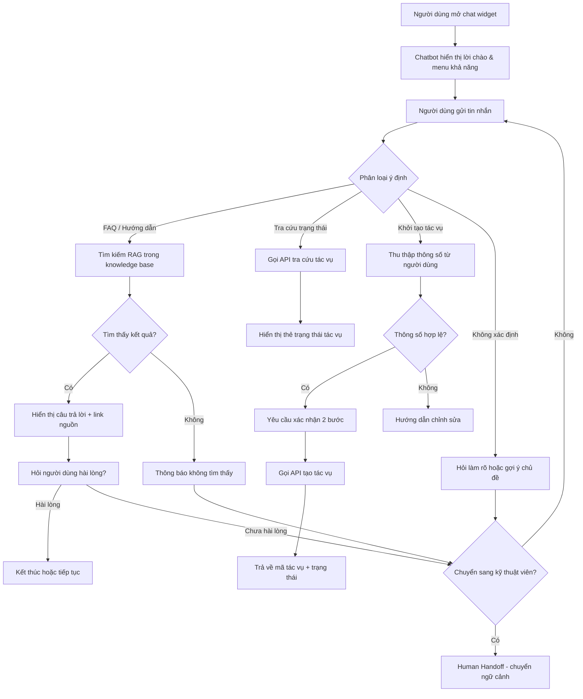
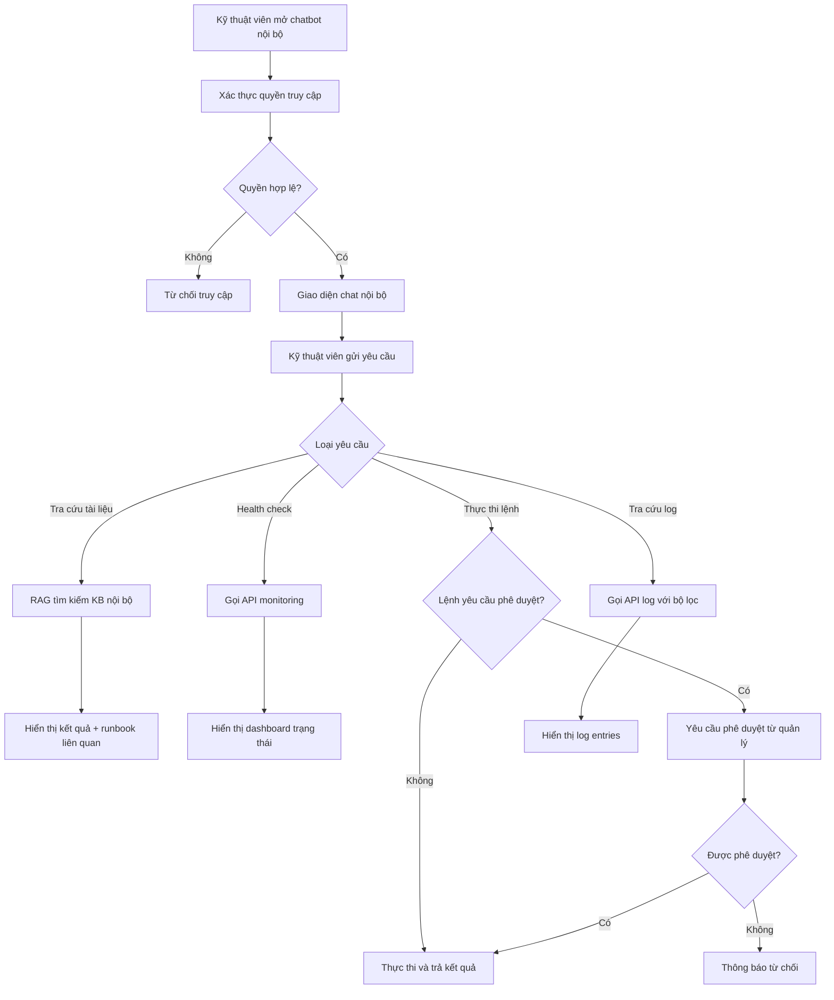
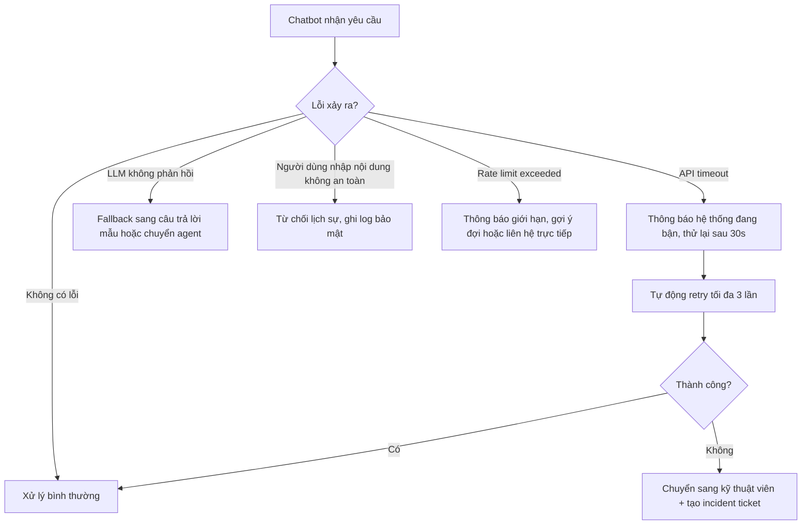

# Chatbot cho Hệ thống SaaS Khôi phục & Trích xuất Dữ liệu — Báo cáo Brainstorming Phân tích Nghiệp vụ

**Ngày:** 2026-05-20
**Tác giả:** BA Team
**Phiên bản:** 1.0
**Trạng thái:** Bản nháp
**Ngôn ngữ:** Tiếng Việt
**Lĩnh vực phần mềm:** Khôi phục dữ liệu & Trích xuất dữ liệu (Data Recovery & Data Extraction SaaS)

---

## Mục lục

1. [Tổng quan tính năng](#1-tổng-quan-tính-năng)
2. [Nghiên cứu đối thủ & Tham chiếu](#2-nghiên-cứu-đối-thủ--tham-chiếu)
3. [Phân tích mẫu UI/UX](#3-phân-tích-mẫu-uiux)
4. [Phân rã tính năng](#4-phân-rã-tính-năng)
5. [Luồng quy trình](#5-luồng-quy-trình)
6. [Quy tắc nghiệp vụ](#6-quy-tắc-nghiệp-vụ)
7. [Câu hỏi mở & Bước tiếp theo](#7-câu-hỏi-mở--bước-tiếp-theo)
8. [Bảng thuật ngữ chuyên ngành](#8-bảng-thuật-ngữ-chuyên-ngành)

---

## 1. Tổng quan tính năng

### Bối cảnh nghiệp vụ

Hệ thống SaaS khôi phục và trích xuất dữ liệu phục vụ khách hàng doanh nghiệp với các tác vụ phức tạp: khôi phục dữ liệu bị mất, trích xuất dữ liệu từ nhiều nguồn, giám sát tình trạng bản sao lưu, và quản lý chính sách bảo vệ dữ liệu. Việc tích hợp chatbot AI vào hệ thống giúp:

- **Giảm tải đội ngũ hỗ trợ kỹ thuật:** Chatbot xử lý các câu hỏi thường gặp về trạng thái tác vụ, hướng dẫn sử dụng, khắc phục sự cố cơ bản — giảm đáng kể lượng ticket hỗ trợ.
- **Tăng tốc thời gian phản hồi:** Trong lĩnh vực khôi phục dữ liệu, thời gian là yếu tố sống còn. Chatbot cung cấp hướng dẫn tức thì 24/7 giúp người dùng nhanh chóng khởi tạo tác vụ khôi phục hoặc trích xuất.
- **Hỗ trợ nhân viên nội bộ:** Chatbot giúp kỹ thuật viên tra cứu nhanh tài liệu kỹ thuật, kiểm tra trạng thái hệ thống, và thực thi các lệnh vận hành thông qua ngôn ngữ tự nhiên.
- **Nâng cao trải nghiệm người dùng:** Thay vì phải điều hướng qua nhiều màn hình, người dùng có thể hỏi chatbot để thực hiện tác vụ trực tiếp.

### Người dùng mục tiêu

| Vai trò | Mô tả | Nhu cầu chính với chatbot |
|---------|--------|---------------------------|
| Khách hàng doanh nghiệp (Enterprise Customer) | Quản trị viên CNTT, kỹ sư hạ tầng sử dụng dịch vụ SaaS | Kiểm tra trạng thái tác vụ, khởi tạo khôi phục/trích xuất, xem báo cáo |
| Người dùng cuối (End User) | Nhân viên trong tổ chức khách hàng được cấp quyền truy cập | Tra cứu dữ liệu đã trích xuất, tải file, hỏi hướng dẫn sử dụng |
| Kỹ thuật viên hỗ trợ (Support Engineer) | Nhân viên nội bộ của công ty SaaS | Tra cứu tài liệu kỹ thuật, kiểm tra log hệ thống, thực thi lệnh vận hành |
| Quản trị viên hệ thống (System Admin) | Quản lý cấu hình, chính sách sao lưu và khôi phục | Cấu hình chính sách, xem tổng quan hệ thống, nhận cảnh báo |

### Phạm vi

**Trong phạm vi:**
- Chatbot hỗ trợ khách hàng: trả lời FAQ, hướng dẫn sử dụng, tra cứu trạng thái tác vụ
- Chatbot hỗ trợ nội bộ: tra cứu tài liệu, kiểm tra hệ thống, thực thi lệnh cơ bản
- Tích hợp AI/LLM (Retrieval-Augmented Generation — RAG) với knowledge base nội bộ
- Chuyển tiếp sang nhân viên hỗ trợ khi chatbot không xử lý được (human handoff)
- Giao diện chat widget nhúng trong ứng dụng web

**Ngoài phạm vi:**
- Chatbot voice/giọng nói
- Tích hợp chatbot trên nền tảng bên thứ ba (Slack, Teams) — sẽ xem xét ở phase sau
- Tự động hóa hoàn toàn quy trình khôi phục dữ liệu không cần xác nhận người dùng

---

## 2. Nghiên cứu đối thủ & Tham chiếu

### 2.1 Đối thủ trực tiếp

| # | Sản phẩm | URL | Cách triển khai chatbot/AI assistant | Điểm mạnh | Điểm yếu |
|---|----------|-----|--------------------------------------|------------|-----------|
| 1 | **Cohesity Copilot** | [docs.cohesity.com/copilot](https://docs.cohesity.com/disaster-recovery/copilot/overview.htm) | AI assistant tích hợp trong dashboard, sử dụng RAG để trả lời bằng ngôn ngữ tự nhiên. Hỗ trợ tạo recovery group, Blueprint, và tra cứu báo cáo. Tích hợp với Microsoft 365 Copilot qua Cohesity Gaia. | Tích hợp sâu với sản phẩm, hỗ trợ tác vụ phức tạp (tạo Blueprint), RAG cho độ chính xác cao | Yêu cầu cấu hình phức tạp, chủ yếu phục vụ admin, chưa có chatbot cho end-user |
| 2 | **Rubrik Ruby AI** | [rubrik.com/products/ai-powered-cyber-recovery](https://www.rubrik.com/products/ai-powered-cyber-recovery) | AI companion sử dụng Amazon Bedrock, phân tích xóa/mã hóa dữ liệu, cảnh báo mối đe dọa trong bản sao lưu, xác định bản sao lưu sạch gần nhất. | Phát hiện mối đe dọa thông minh, tự động xác định điểm khôi phục sạch | Tập trung vào bảo mật hơn là hỗ trợ người dùng trực tiếp |
| 3 | **Veeam Intelligence** | [veeam.com/products/data-intelligence](https://www.veeam.com/products/veeam-portfolio/data-intelligence.html) | Chatbot được đào tạo trên tài liệu kỹ thuật Veeam, hỗ trợ khắc phục sự cố và trả lời câu hỏi về sản phẩm. Tích hợp AI phân tích hiệu suất sao lưu và dự đoán rủi ro. | Giao diện chatbot thân thiện, knowledge base phong phú, dự đoán rủi ro | Chatbot chủ yếu hỗ trợ sản phẩm, chưa thực thi được tác vụ trực tiếp |
| 4 | **Intercom Fin AI** | [intercom.com](https://www.intercom.com/) | AI agent giải quyết câu hỏi khách hàng tức thì từ knowledge base, bài viết hỗ trợ, và lịch sử hội thoại. Độ chính xác 96%. Tỷ lệ giải quyết tự động 40-60%. | Độ chính xác cao, triển khai nhanh, chuyển tiếp mượt sang agent | Giải pháp tổng quát, không chuyên biệt cho data recovery |
| 5 | **Zendesk AI Agents** | [zendesk.com](https://www.zendesk.com/) | AI triage, định tuyến thông minh, gợi ý trả lời, AI agent (trước là Answer Bot). Tỷ lệ deflection khoảng 38%. | Hệ sinh thái enterprise lớn, tích hợp đa kênh | Tỷ lệ deflection thấp hơn Intercom, cần tùy chỉnh nhiều |

### 2.2 Tham chiếu LinkedIn

| # | Tác giả & Tiêu đề | URL | Điểm nổi bật |
|---|-------------------|-----|--------------|
| 1 | AI-Powered SaaS: The New Benchmark for Productivity 2025 | [LinkedIn Pulse](https://www.linkedin.com/pulse/ai-powered-saas-new-benchmark-productivity-2025-grepix-infotech-uoz1c) | AI đang trở thành tiêu chuẩn bắt buộc cho SaaS, đặc biệt trong tự động hóa tác vụ lặp lại và hỗ trợ người dùng |
| 2 | AI eats Software and more: five key trends in SAAS | [LinkedIn Pulse](https://www.linkedin.com/pulse/ai-eats-software-more-five-key-trends-saas-jacques-bughin-cy9re) | Mô hình định giá SaaS đang chuyển sang usage-based (tính theo cuộc hội thoại), ví dụ LivePerson tính phí theo số cuộc chat AI xử lý |
| 3 | The Ultimate AI Agents Cheatsheet 2025 | [LinkedIn Post](https://www.linkedin.com/posts/piyush-ranjan-9297a632_the-ultimate-ai-agents-cheatsheet-you-need-activity-7320647962043326464-ZtyC) | Tổng hợp kiến trúc AI agent hiện đại, phân biệt chatbot đơn giản vs AI agent có khả năng thực thi tác vụ |
| 4 | Building ChatBot using govCMS (SaaS), NodeJS and Dialogflow | [LinkedIn Pulse](https://www.linkedin.com/pulse/building-integrating-chatbot-using-govcms-saas-nodejs-abdullah-quazi) | Case study kỹ thuật về tích hợp chatbot vào nền tảng SaaS sử dụng Dialogflow, kiến trúc webhook-based |

### 2.3 Bài viết & Nghiên cứu điển hình

| # | Tiêu đề | Nguồn | URL | Điểm chính |
|---|---------|-------|-----|------------|
| 1 | AI and backup: How backup products leverage AI | Computer Weekly | [computerweekly.com](https://www.computerweekly.com/feature/AI-and-backup-How-backup-products-leverage-AI) | So sánh cách Rubrik, Cohesity, Veeam tích hợp AI vào sản phẩm bảo vệ dữ liệu |
| 2 | AI Chatbot Recovery Strategies: How SaaS Teams Win Back Trust Fast | Gleap Blog | [gleap.io/blog](https://www.gleap.io/blog/ai-chatbot-recovery-strategies) | Chiến lược xử lý khi chatbot thất bại: minh bạch, chuyển tiếp nhanh, hybrid AI + live chat |
| 3 | AI-Driven Data Resilience: Veeam vs Rubrik Architecture Decision Guide | Rack2Cloud | [rack2cloud.com](https://www.rack2cloud.com/ai-driven-data-resilience-veeam-rubrik/) | Hướng dẫn kiến trúc so sánh Veeam và Rubrik trong khả năng phục hồi dữ liệu dựa trên AI |
| 4 | Integrating AI Chatbots in SaaS Products | Medium | [medium.com](https://mikelvu.medium.com/integrating-ai-chatbots-in-saas-products-429148bca50c) | Hướng dẫn thực hành tích hợp chatbot AI vào sản phẩm SaaS, bao gồm kiến trúc và best practices |
| 5 | Top 12 AI Customer Service Chatbots for 2026 | Fini Labs | [usefini.com](https://www.usefini.com/guides/top-ai-customer-service-chatbots) | Đánh giá và xếp hạng các chatbot AI hỗ trợ khách hàng hàng đầu 2026 |

---

## 3. Phân tích mẫu UI/UX

### 3.1 Mẫu thiết kế

**Mẫu 1: Chat Widget nổi (Floating Chat Widget)**
- Mô tả: Nút chat hình tròn cố định ở góc dưới bên phải màn hình, mở ra cửa sổ chat overlay. Đây là mẫu phổ biến nhất cho SaaS B2B.
- Tham chiếu: [Chatbot UI Design Patterns — FuseLab](https://fuselabcreative.com/chatbot-interface-design-guide/)
- Sản phẩm sử dụng: Intercom, Zendesk, Drift, Tidio

**Mẫu 2: Command Palette / Copilot tích hợp (Embedded AI Assistant)**
- Mô tả: AI assistant tích hợp trực tiếp vào giao diện sản phẩm, người dùng gõ lệnh bằng ngôn ngữ tự nhiên trong thanh tìm kiếm hoặc panel chuyên dụng. Phù hợp cho tác vụ kỹ thuật phức tạp.
- Tham chiếu: [Cohesity Copilot](https://docs.cohesity.com/disaster-recovery/copilot/overview.htm)
- Sản phẩm sử dụng: Cohesity Copilot, GitHub Copilot, Notion AI

**Mẫu 3: Nút hành động nhanh (Quick Reply Buttons / Suggested Actions)**
- Mô tả: Hiển thị các nút bấm gợi ý phía dưới tin nhắn chatbot, giúp người dùng chọn nhanh thay vì phải gõ. Giảm ma sát và thể hiện rõ khả năng của chatbot.
- Tham chiếu: [Sendbird Chatbot UI](https://sendbird.com/blog/chatbot-ui)
- Sản phẩm sử dụng: Intercom Fin, Drift, Ada

**Mẫu 4: Thẻ trạng thái (Status Cards / Rich Messages)**
- Mô tả: Chatbot trả về kết quả dạng thẻ có cấu trúc (card) thay vì thuần văn bản — ví dụ: thẻ hiển thị trạng thái tác vụ khôi phục với thanh tiến trình, thời gian còn lại, và nút hành động.
- Tham chiếu: [Eleken Chatbot UI Examples](https://www.eleken.co/blog-posts/chatbot-ui-examples)
- Sản phẩm sử dụng: Slack bots, Microsoft Teams bots, Veeam Intelligence

### 3.2 Ví dụ sản phẩm thực tế

| Sản phẩm | Mẫu sử dụng | Tại sao hiệu quả |
|----------|-------------|-------------------|
| Cohesity Copilot | Embedded AI Assistant | Người dùng thao tác ngay trong context sản phẩm, không cần chuyển màn hình. Sử dụng RAG đảm bảo câu trả lời chính xác. |
| Intercom Fin | Floating Widget + Quick Reply | Triển khai nhanh, 96% độ chính xác, chuyển tiếp mượt sang human agent khi cần. |
| Veeam Intelligence | Embedded chatbot trong Help Center | Đào tạo trên tài liệu kỹ thuật, người dùng được hỗ trợ ngay tại nơi họ tìm kiếm trợ giúp. |

### 3.3 Mẫu chống nên tránh

| Mẫu chống | Tại sao không tốt | Giải pháp thay thế |
|-----------|-------------------|---------------------|
| Tường văn bản (Wall of Text) | Người dùng không đọc tin nhắn dài quá 60 từ, đặc biệt trên mobile. Trong ngữ cảnh data recovery, người dùng đang gấp và cần thông tin nhanh. | Chia tin nhắn thành nhiều đoạn ngắn, mỗi đoạn 1 ý. Dùng thẻ trạng thái cho dữ liệu có cấu trúc. |
| Không có lối thoát đến con người (No Human Escape) | Khi chatbot không giải quyết được yêu cầu khôi phục dữ liệu khẩn cấp mà không có cách chuyển sang agent, khách hàng mất niềm tin. | Luôn hiển thị nút "Nói chuyện với kỹ thuật viên" sau 2 lượt chatbot không trả lời được. |
| Bot giả làm người (Over-humanized Bot) | Tạo kỳ vọng sai về khả năng chatbot, đặc biệt trong lĩnh vực kỹ thuật phức tạp như khôi phục dữ liệu. | Giới thiệu rõ chatbot là AI assistant ngay từ đầu. Minh bạch về giới hạn khả năng. |
| Không rõ khả năng (Capability Ambiguity) | Người dùng không biết chatbot có thể giúp gì, dẫn đến hỏi sai và thất vọng. | Hiển thị menu khả năng khi bắt đầu hội thoại và dùng nút gợi ý hành động. |

---

## 4. Phân rã tính năng

### 4.1 Bản đồ Epic & Tính năng

```
Epic 1: Chatbot hỗ trợ khách hàng (Customer-facing Chatbot)
├── Feature 1.1: Hỏi đáp tự động từ Knowledge Base
│   ├── US-001: Trả lời câu hỏi thường gặp (FAQ)
│   ├── US-002: Tra cứu tài liệu hướng dẫn sử dụng
│   └── US-003: Gợi ý bài viết liên quan
├── Feature 1.2: Tra cứu trạng thái tác vụ
│   ├── US-004: Kiểm tra trạng thái tác vụ khôi phục dữ liệu
│   ├── US-005: Kiểm tra trạng thái tác vụ trích xuất dữ liệu
│   └── US-006: Xem lịch sử tác vụ gần đây
├── Feature 1.3: Khởi tạo tác vụ qua chat
│   ├── US-007: Khởi tạo tác vụ khôi phục dữ liệu
│   ├── US-008: Khởi tạo tác vụ trích xuất dữ liệu
│   └── US-009: Hủy hoặc tạm dừng tác vụ đang chạy
├── Feature 1.4: Chuyển tiếp sang nhân viên hỗ trợ (Human Handoff)
│   ├── US-010: Chuyển hội thoại sang kỹ thuật viên
│   └── US-011: Ghi nhận mức độ hài lòng sau hội thoại
│
Epic 2: Chatbot hỗ trợ nội bộ (Internal Support Chatbot)
├── Feature 2.1: Tra cứu tài liệu kỹ thuật nội bộ
│   ├── US-012: Tìm kiếm trong knowledge base nội bộ
│   └── US-013: Tra cứu runbook xử lý sự cố
├── Feature 2.2: Giám sát hệ thống qua chat
│   ├── US-014: Kiểm tra trạng thái hệ thống (health check)
│   ├── US-015: Xem cảnh báo (alerts) đang hoạt động
│   └── US-016: Tra cứu log hệ thống theo bộ lọc
├── Feature 2.3: Thực thi lệnh vận hành
│   ├── US-017: Thực thi lệnh khôi phục khẩn cấp
│   └── US-018: Cập nhật chính sách sao lưu
│
Epic 3: Hạ tầng chatbot (Chatbot Infrastructure)
├── Feature 3.1: Nền tảng AI / NLU
│   ├── US-019: Tích hợp LLM với RAG trên knowledge base
│   └── US-020: Huấn luyện mô hình nhận dạng ý định (intent recognition)
├── Feature 3.2: Quản lý hội thoại
│   ├── US-021: Quản lý ngữ cảnh hội thoại (conversation context)
│   └── US-022: Lưu trữ và phân tích lịch sử hội thoại
└── Feature 3.3: Quản trị chatbot
    ├── US-023: Dashboard thống kê chatbot
    ├── US-024: Quản lý knowledge base
    └── US-025: Cấu hình luồng hội thoại (conversation flow)
```

### 4.2 User Stories & Tiêu chí chấp nhận

**US-001: Trả lời câu hỏi thường gặp (FAQ)**
- Là một khách hàng doanh nghiệp, tôi muốn hỏi chatbot các câu hỏi thường gặp về dịch vụ khôi phục và trích xuất dữ liệu để nhận câu trả lời tức thì mà không cần tạo ticket hỗ trợ.
- Ưu tiên: Phải có
- Tiêu chí chấp nhận:
  - Khi người dùng gửi câu hỏi liên quan đến FAQ, thì chatbot trả lời trong vòng 3 giây với nội dung chính xác từ knowledge base.
  - Khi chatbot không tìm thấy câu trả lời phù hợp, thì hiển thị thông báo xin lỗi kèm gợi ý chuyển sang kỹ thuật viên.
  - Khi chatbot trả lời, thì kèm link đến bài viết gốc trong knowledge base.

**US-004: Kiểm tra trạng thái tác vụ khôi phục dữ liệu**
- Là một quản trị viên CNTT, tôi muốn hỏi chatbot về trạng thái tác vụ khôi phục dữ liệu đang chạy để biết tiến độ mà không cần vào trang chi tiết tác vụ.
- Ưu tiên: Phải có
- Tiêu chí chấp nhận:
  - Khi người dùng hỏi "trạng thái khôi phục" hoặc cung cấp mã tác vụ, thì chatbot hiển thị thẻ trạng thái gồm: tên tác vụ, phần trăm hoàn thành, thời gian ước tính còn lại, trạng thái (đang chạy/hoàn thành/lỗi).
  - Khi tác vụ gặp lỗi, thì chatbot hiển thị mã lỗi, mô tả ngắn, và gợi ý bước khắc phục.

**US-007: Khởi tạo tác vụ khôi phục dữ liệu qua chat**
- Là một quản trị viên CNTT, tôi muốn ra lệnh khôi phục dữ liệu thông qua chatbot bằng ngôn ngữ tự nhiên để tiết kiệm thời gian thao tác.
- Ưu tiên: Nên có
- Tiêu chí chấp nhận:
  - Khi người dùng yêu cầu khôi phục, thì chatbot hỏi xác nhận các thông số: nguồn dữ liệu, điểm khôi phục (recovery point), đích khôi phục.
  - Khi người dùng xác nhận, thì chatbot gọi API khởi tạo tác vụ và trả về mã tác vụ.
  - Khi thông số không hợp lệ, thì chatbot hướng dẫn người dùng chỉnh sửa cụ thể.
  - Tác vụ khôi phục luôn yêu cầu xác nhận 2 bước (double confirmation) trước khi thực thi.

**US-010: Chuyển hội thoại sang kỹ thuật viên**
- Là một khách hàng, tôi muốn được chuyển sang nói chuyện với kỹ thuật viên thật khi chatbot không giải quyết được vấn đề của tôi để được hỗ trợ kịp thời.
- Ưu tiên: Phải có
- Tiêu chí chấp nhận:
  - Khi người dùng yêu cầu hoặc khi chatbot không trả lời được sau 2 lượt, thì hiển thị nút "Chuyển sang kỹ thuật viên".
  - Khi chuyển tiếp, thì toàn bộ ngữ cảnh hội thoại được gửi kèm để kỹ thuật viên không hỏi lại.
  - Khi không có kỹ thuật viên online, thì chatbot tạo ticket tự động và thông báo thời gian phản hồi dự kiến.

**US-014: Kiểm tra trạng thái hệ thống (Health Check)**
- Là một kỹ thuật viên hỗ trợ, tôi muốn hỏi chatbot nội bộ về tình trạng hệ thống hiện tại để nhanh chóng đánh giá có sự cố hay không.
- Ưu tiên: Phải có
- Tiêu chí chấp nhận:
  - Khi kỹ thuật viên hỏi "health check" hoặc "trạng thái hệ thống", thì chatbot hiển thị bảng tổng quan: CPU, RAM, dung lượng lưu trữ, số tác vụ đang chạy, cảnh báo đang hoạt động.
  - Khi có cảnh báo nghiêm trọng (critical), thì chatbot tự động gắn nhãn ưu tiên cao và gợi ý runbook xử lý.

**US-019: Tích hợp LLM với RAG trên knowledge base**
- Là một quản trị viên chatbot, tôi muốn chatbot sử dụng Retrieval-Augmented Generation để trả lời dựa trên tài liệu nội bộ cập nhật để đảm bảo câu trả lời chính xác và đúng ngữ cảnh sản phẩm.
- Ưu tiên: Phải có
- Tiêu chí chấp nhận:
  - Khi chatbot nhận câu hỏi, thì nó tìm kiếm trong vector store chứa tài liệu knowledge base, lấy top-k đoạn văn liên quan, và sinh câu trả lời dựa trên đó.
  - Khi không có tài liệu phù hợp (similarity score dưới ngưỡng), thì chatbot thông báo rõ thay vì bịa câu trả lời (hallucination prevention).
  - Knowledge base phải được cập nhật tự động khi có bài viết mới.

### 4.3 Phân loại ưu tiên — MoSCoW

| Ưu tiên | User Stories | Số lượng |
|---------|-------------|:--------:|
| Phải có (Must have) | US-001, US-002, US-004, US-005, US-010, US-011, US-014, US-019, US-021 | 9 |
| Nên có (Should have) | US-003, US-006, US-007, US-008, US-012, US-013, US-015, US-020, US-022, US-023 | 10 |
| Có thể có (Could have) | US-009, US-016, US-017, US-018, US-024, US-025 | 6 |
| Sẽ không có lần này (Won't have) | — | 0 |

---

## 5. Luồng quy trình

### 5.1 Luồng chính — Khách hàng hỏi chatbot



### 5.2 Luồng thay thế — Chatbot nội bộ cho kỹ thuật viên



### 5.3 Xử lý lỗi



---

## 6. Quy tắc nghiệp vụ

| Mã quy tắc | Quy tắc | Loại | Ưu tiên |
|-------------|---------|------|---------|
| BRULE-001 | Chatbot phải sử dụng RAG và chỉ trả lời dựa trên nội dung knowledge base. Nếu similarity score < 0.7, chatbot phải thông báo không tìm thấy thay vì tự sinh câu trả lời (chống hallucination). | Xác thực nội dung | Phải có |
| BRULE-002 | Mọi tác vụ khôi phục dữ liệu khởi tạo qua chatbot đều yêu cầu xác nhận 2 bước (double confirmation): chatbot tóm tắt thông số → người dùng xác nhận → chatbot hỏi lại lần cuối → thực thi. | Xác nhận tác vụ | Phải có |
| BRULE-003 | Chatbot tự động chuyển sang kỹ thuật viên (human handoff) khi: (a) không trả lời được sau 2 lượt liên tiếp, (b) người dùng yêu cầu rõ ràng, hoặc (c) phát hiện từ khóa khẩn cấp ("mất dữ liệu", "không truy cập được", "sự cố nghiêm trọng"). | Chuyển tiếp | Phải có |
| BRULE-004 | Chatbot nội bộ chỉ cho phép thực thi lệnh vận hành (ví dụ: khôi phục khẩn cấp, thay đổi chính sách sao lưu) khi kỹ thuật viên có quyền tương ứng trong hệ thống RBAC. Lệnh ảnh hưởng production yêu cầu phê duyệt từ quản lý. | Phân quyền | Phải có |
| BRULE-005 | Thời gian phản hồi chatbot tối đa: 3 giây cho FAQ, 5 giây cho tra cứu trạng thái tác vụ, 10 giây cho truy vấn phức tạp (tra cứu log, health check). Quá thời gian → hiển thị trạng thái "đang xử lý". | Hiệu suất | Nên có |
| BRULE-006 | Mỗi phiên hội thoại chatbot được lưu trữ tối thiểu 90 ngày phục vụ phân tích và audit. Dữ liệu nhạy cảm (mật khẩu, token) phải được mã hóa hoặc loại bỏ (redact) trước khi lưu. | Lưu trữ & Bảo mật | Phải có |
| BRULE-007 | Chatbot phải hỗ trợ đa ngôn ngữ (ít nhất tiếng Việt và tiếng Anh). Ngôn ngữ được tự động phát hiện từ tin nhắn đầu tiên của người dùng hoặc cài đặt tài khoản. | Đa ngôn ngữ | Nên có |
| BRULE-008 | Khi chatbot gợi ý bài viết từ knowledge base, phải kèm link truy cập trực tiếp và hiển thị độ liên quan (confidence score) để người dùng đánh giá. | Minh bạch | Nên có |
| BRULE-009 | Rate limit: mỗi người dùng tối đa 60 tin nhắn/giờ cho chatbot khách hàng, 120 tin nhắn/giờ cho chatbot nội bộ. Vượt giới hạn → thông báo và gợi ý liên hệ trực tiếp. | Giới hạn sử dụng | Có thể có |

---

## 7. Câu hỏi mở & Bước tiếp theo

### Câu hỏi cần làm rõ

| # | Câu hỏi | Người phụ trách | Trạng thái |
|---|---------|----------------|-----------|
| 1 | Sử dụng LLM nào làm nền tảng? (OpenAI GPT, Anthropic Claude, self-hosted open-source model?) | CTO / Tech Lead | Mở |
| 2 | Knowledge base hiện tại có sẵn ở định dạng nào? (Confluence, Notion, markdown files, database?) | Product Owner | Mở |
| 3 | Hệ thống hiện tại có API cho tra cứu trạng thái tác vụ và khởi tạo tác vụ chưa? Hay cần xây mới? | Backend Lead | Mở |
| 4 | Mức độ ưu tiên giữa chatbot khách hàng vs chatbot nội bộ? Triển khai cùng lúc hay chia phase? | Product Owner | Mở |
| 5 | Yêu cầu compliance/bảo mật: dữ liệu hội thoại có cần lưu on-premise không? GDPR/PDPA có áp dụng? | Legal / Security | Mở |
| 6 | Ngân sách và timeline mong muốn cho MVP? | Project Manager | Mở |
| 7 | Tích hợp với hệ thống ticketing nào? (Jira Service Desk, Zendesk, nội bộ?) | Support Lead | Mở |

### Các bước tiếp theo đề xuất

1. **Họp stakeholder** — Trình bày tài liệu brainstorm này, thu thập phản hồi và trả lời các câu hỏi mở.
2. **Chọn kiến trúc kỹ thuật** — Quyết định LLM, vector database (Pinecone, Weaviate, Qdrant), và framework chatbot (LangChain, LlamaIndex).
3. **Viết BRD chi tiết** — Dựa trên phản hồi stakeholder, viết Business Requirements Document chính thức.
4. **Thiết kế UI mockup** — Tạo prototype giao diện chatbot widget cho cả khách hàng và nội bộ.
5. **Xây dựng MVP (Phase 1)** — Tập trung vào: FAQ chatbot + tra cứu trạng thái tác vụ + human handoff.
6. **Pilot testing** — Triển khai thử với nhóm khách hàng beta trước khi rollout toàn bộ.

---

## 8. Bảng thuật ngữ chuyên ngành

| Thuật ngữ tiếng Anh | Thuật ngữ tiếng Việt | Định nghĩa |
|---------------------|---------------------|-------------|
| Data Recovery | Khôi phục dữ liệu | Quá trình lấy lại dữ liệu bị mất, xóa, hoặc hư hỏng từ các bản sao lưu hoặc thiết bị lưu trữ |
| Data Extraction | Trích xuất dữ liệu | Quá trình lấy dữ liệu có cấu trúc từ các nguồn khác nhau (database, file, API) |
| Recovery Point | Điểm khôi phục | Thời điểm cụ thể của bản sao lưu mà dữ liệu sẽ được khôi phục về |
| Backup Policy | Chính sách sao lưu | Bộ quy tắc định nghĩa tần suất, phạm vi, và thời gian lưu giữ bản sao lưu |
| Human Handoff | Chuyển tiếp sang nhân viên | Quy trình chuyển hội thoại từ chatbot sang nhân viên hỗ trợ thật |
| RAG (Retrieval-Augmented Generation) | RAG | Kỹ thuật kết hợp tìm kiếm tài liệu (retrieval) với sinh văn bản (generation) để chatbot trả lời chính xác dựa trên dữ liệu nội bộ |
| Knowledge Base | Cơ sở tri thức | Kho tài liệu có cấu trúc chứa hướng dẫn, FAQ, và tài liệu kỹ thuật phục vụ chatbot |
| Intent Recognition | Nhận dạng ý định | Khả năng chatbot hiểu mục đích của tin nhắn người dùng (ví dụ: hỏi FAQ vs tra cứu trạng thái) |
| Conversation Context | Ngữ cảnh hội thoại | Thông tin được duy trì xuyên suốt cuộc hội thoại giúp chatbot hiểu liên hệ giữa các tin nhắn |
| Runbook | Runbook / Sổ tay vận hành | Tài liệu hướng dẫn từng bước xử lý sự cố hoặc tác vụ vận hành cụ thể |
| Health Check | Kiểm tra sức khỏe hệ thống | Tác vụ kiểm tra tổng quan trạng thái hoạt động của các thành phần hệ thống |
| RBAC (Role-Based Access Control) | Phân quyền theo vai trò | Mô hình kiểm soát truy cập dựa trên vai trò người dùng trong tổ chức |
| Hallucination | Ảo giác (AI) | Hiện tượng LLM tự sinh ra thông tin không chính xác hoặc bịa đặt |
| Vector Store | Kho vector | Cơ sở dữ liệu lưu trữ embedding vectors phục vụ tìm kiếm ngữ nghĩa trong RAG |
| Deflection Rate | Tỷ lệ tự động giải quyết | Phần trăm yêu cầu hỗ trợ được chatbot giải quyết mà không cần chuyển sang nhân viên |
| Ticket | Phiếu yêu cầu hỗ trợ | Đơn vị quản lý yêu cầu trong hệ thống hỗ trợ khách hàng |

---

*Tài liệu này là bản brainstorm ban đầu, phục vụ làm đầu vào cho các buổi họp stakeholder và viết BRD/FRD chính thức.*
